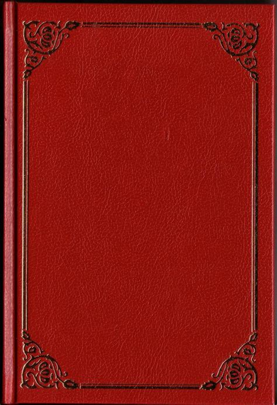

The greatest books of all time!!! (According to me)\

::: {.callout-note title="Notes"}
- Work in progress...
- Click on a Tag to filter the list!
- Novels only.
:::

  <button class="btn btn-primary dropdown-toggle" type="button"
          data-bs-toggle="dropdown" aria-expanded="false">
    Sort
  </button>
  <ul class="dropdown-menu">
    <li>
      <a class="dropdown-item" href="#"
         onclick="sortSections('rating','desc'); return false;">
        Rating
      </a>
    </li>
    <li>
      <a class="dropdown-item" href="#"
         onclick="sortSections('title','asc',false); return false;">
        Title
      </a>
    </li>
    <li>
      <a class="dropdown-item" href="#"
         onclick="sortSections('author','asc',false); return false;">
        Author
      </a>
    </li>
    <li>
      <a class="dropdown-item" href="#"
         onclick="sortSections('year','asc'); return false;">
        Year
      </a>
    </li>
    <li>
      <a class="dropdown-item" href="#"
         onclick="sortSections('country','asc',false); return false;">
        Country
      </a>
    </li>
  </ul>

 

## Adrian Tchaikovsky - Alien Clay{.book data-country="United Kingdom" data-rating="8" data-year="2024" data-title="Alien Clay" data-author="Adrian Tchaikovsky"}

<strong>Year:</strong> 2024 <strong>Country:</strong> 🇬🇧 United Kingdom <strong>Genres:</strong> Science Fiction <strong>Verdict:</strong> 8/10 Nice 👍 

## R. F. Kuang - Babel, or The Necessity of Violence: An Arcane History of the Oxford Translators' Revolution{.book .the_revolution_will_not_be_televised data-country="United Kingdom" data-rating="9" data-year="2022" data-title="Babel, or The Necessity of Violence: An Arcane History of the Oxford Translators' Revolution" data-author="R. F. Kuang"}

<strong>Year:</strong> 2022 <strong>Country:</strong> 🇬🇧 United Kingdom <strong>Genres:</strong> Fantasy, Alternative History <strong>Verdict:</strong> 9/10 Amazing ❤️ 

<button id="the_revolution_will_not_be_televised" class="badge bg-primary rounded-pill border-0" onclick="toggleTag(this, 'the_revolution_will_not_be_televised')">The Revolution Will Not Be Televised</button>

## Kazuo Ishiguo - Klara and the Sun{.book data-country="United Kingdom" data-rating="8" data-year="2022" data-title="Klara and the Sun" data-author="Kazuo Ishiguo"}

<strong>Year:</strong> 2022 <strong>Country:</strong> 🇬🇧 United Kingdom <strong>Genres:</strong> Science Fiction <strong>Verdict:</strong> 8/10 Nice 👍 

## Sally Rooney - Beautiful World, Where Are You{.book data-country="Ireland" data-rating="8" data-year="2021" data-title="Beautiful World, Where Are You" data-author="Sally Rooney"}

<strong>Year:</strong> 2021 <strong>Country:</strong> 🇮🇪 Ireland <strong>Genres:</strong> Contemporary Fiction <strong>Verdict:</strong> 8/10 Nice 👍 

## Scott Sigler - Aliens: Phalanx{.book data-country="United States" data-rating="8" data-year="2020" data-title="Aliens: Phalanx" data-author="Scott Sigler"}

<strong>Year:</strong> 2020 <strong>Country:</strong> 🇺🇸 United States <strong>Genres:</strong> Science Fiction, Horror <strong>Verdict:</strong> 8/10 Nice 👍 

## Susan Abulhawa - Against the Loveless World{.book .book_club .abolish_the_patriarchy data-country="United Kingdom" data-rating="8" data-year="2019" data-title="Against the Loveless World" data-author="Susan Abulhawa"}

<strong>Year:</strong> 2019 <strong>Country:</strong> 🇬🇧 United Kingdom <strong>Genres:</strong> Literary Fiction <strong>Verdict:</strong> 8/10 Nice 👍 

<button id="book_club" class="badge bg-primary rounded-pill border-0" onclick="toggleTag(this, 'book_club')">Book Club</button><button id="abolish_the_patriarchy" class="badge bg-primary rounded-pill border-0" onclick="toggleTag(this, 'abolish_the_patriarchy')"> Abolish the Patriarchy</button>

## Adrian Tchaikovsky - Children of Time{.book .creative_genius data-country="United Kingdom" data-rating="10" data-year="2015" data-title="Children of Time" data-author="Adrian Tchaikovsky"}

<strong>Year:</strong> 2015 <strong>Country:</strong> 🇬🇧 United Kingdom <strong>Genres:</strong> Science Fiction <strong>Verdict:</strong> 10/10 All-time Fave ❤️‍🔥 

<button id="creative_genius" class="badge bg-primary rounded-pill border-0" onclick="toggleTag(this, 'creative_genius')">Creative Genius</button>

## Elif Shafak - Honour{.book .book_club .abolish_the_patriarchy data-country="Turkey" data-rating="8" data-year="2012" data-title="Honour" data-author="Elif Shafak"}

<strong>Year:</strong> 2012 <strong>Country:</strong> 🇹🇷 Turkey <strong>Genres:</strong> Literary Fiction <strong>Verdict:</strong> 8/10 Nice 👍 

<button id="book_club" class="badge bg-primary rounded-pill border-0" onclick="toggleTag(this, 'book_club')">Book Club</button><button id="abolish_the_patriarchy" class="badge bg-primary rounded-pill border-0" onclick="toggleTag(this, 'abolish_the_patriarchy')"> Abolish the Patriarchy</button>

## Joseph Boyden - Three Day Road{.book data-country="Canada" data-rating="8" data-year="2005" data-title="Three Day Road" data-author="Joseph Boyden"}

<strong>Year:</strong> 2005 <strong>Country:</strong> 🇨🇦 Canada <strong>Genres:</strong> Historical Fiction, War <strong>Verdict:</strong> 8/10 Nice 👍 

## China Miéville - The Scar{.book .creative_genius data-country="United Kingdom" data-rating="10" data-year="2004" data-title="The Scar" data-author="China Miéville"}

<strong>Year:</strong> 2004 <strong>Country:</strong> 🇬🇧 United Kingdom <strong>Genres:</strong> New Weird <strong>Verdict:</strong> 10/10 All-time Fave ❤️‍🔥 

<button id="creative_genius" class="badge bg-primary rounded-pill border-0" onclick="toggleTag(this, 'creative_genius')">Creative Genius</button>

## China Miéville - Perdido Street Station{.book .creative_genius data-country="United Kingdom" data-rating="10" data-year="2000" data-title="Perdido Street Station" data-author="China Miéville"}

<strong>Year:</strong> 2000 <strong>Country:</strong> 🇬🇧 United Kingdom <strong>Genres:</strong> New Weird <strong>Verdict:</strong> 10/10 All-time Fave ❤️‍🔥 

<button id="creative_genius" class="badge bg-primary rounded-pill border-0" onclick="toggleTag(this, 'creative_genius')">Creative Genius</button>

Ultra-grimy urban steampunk epos with amazing prose and a wonderfully bizarre mixture of science fiction, magic, and horror elements. The protagonist is a rogue scientist and his girlfriend is a humanoid insect. It only gets weirder from here. YOU HAVE BEEN WARNED\

## Mark Z. Danielewski - House of Leaves{.book data-country="United States" data-rating="8" data-year="2000" data-title="House of Leaves" data-author="Mark Z. Danielewski"}

<strong>Year:</strong> 2000 <strong>Country:</strong> 🇺🇸 United States <strong>Genres:</strong> Horror, Postmodernism <strong>Verdict:</strong> 8/10 Nice 👍 

## Haruki Murakami - The Wind-Up Bird Chronicle{.book data-country="Japan" data-rating="9" data-year="1997" data-title="The Wind-Up Bird Chronicle" data-author="Haruki Murakami"}

<strong>Year:</strong> 1997 <strong>Country:</strong> 🇯🇵 Japan <strong>Genres:</strong> Magical Realism <strong>Verdict:</strong> 9/10 Amazing ❤️ 

## Kazuo Ishiguo - The Remains of the Day{.book .character_study data-country="United Kingdom" data-rating="9" data-year="1989" data-title="The Remains of the Day" data-author="Kazuo Ishiguo"}

<strong>Year:</strong> 1989 <strong>Country:</strong> 🇬🇧 United Kingdom <strong>Genres:</strong> Literary Fiction <strong>Verdict:</strong> 9/10 Amazing ❤️ 

<button id="character_study" class="badge bg-primary rounded-pill border-0" onclick="toggleTag(this, 'character_study')">Character Study</button>

Character portrait of an elderly English butler choosing to look the other way when witnessing Nazi collaborations at his estate. Shows with understated power how emotional repression and class subservience fueled by national pride circumscribes personal growth and leads to a life of regrets.\

## Octavia Butler - Kindred{.book .abolish_the_patriarchy data-country="United States" data-rating="9" data-year="1979" data-title="Kindred" data-author="Octavia Butler"}

<strong>Year:</strong> 1979 <strong>Country:</strong> 🇺🇸 United States <strong>Genres:</strong> Historical Fiction, Science Fiction <strong>Verdict:</strong> 9/10 Amazing ❤️ 

<button id="abolish_the_patriarchy" class="badge bg-primary rounded-pill border-0" onclick="toggleTag(this, 'abolish_the_patriarchy')">Abolish the Patriarchy</button>

## Italo Calvino - If on a winter's night a traveler{.book .creative_genius data-country="Italy" data-rating="8" data-year="1979" data-title="If on a winter's night a traveler" data-author="Italo Calvino"}

<strong>Year:</strong> 1979 <strong>Country:</strong> 🇮🇹 Italy <strong>Genres:</strong> Postmodernism <strong>Verdict:</strong> 8/10 Nice 👍 

<button id="creative_genius" class="badge bg-primary rounded-pill border-0" onclick="toggleTag(this, 'creative_genius')">Creative Genius</button>

## Douglas Adams - The Hitchhiker’s Guide to the Galaxy{.book data-country="United Kingdom" data-rating="8" data-year="1979" data-title="The Hitchhiker’s Guide to the Galaxy" data-author="Douglas Adams"}

<strong>Year:</strong> 1979 <strong>Country:</strong> 🇬🇧 United Kingdom <strong>Genres:</strong> Science Fiction, Comedy <strong>Verdict:</strong> 8/10 Nice 👍 

## Ursula K. Le Guin - The Dispossessed (An Ambiguous Utopia){.book .the_revolution_will_not_be_televised data-country="United States" data-rating="10" data-year="1974" data-title="The Dispossessed (An Ambiguous Utopia)" data-author="Ursula K. Le Guin"}

<strong>Year:</strong> 1974 <strong>Country:</strong> 🇺🇸 United States <strong>Genres:</strong> Science Fiction <strong>Verdict:</strong> 10/10 All-time Fave ❤️‍🔥 

<button id="the_revolution_will_not_be_televised" class="badge bg-primary rounded-pill border-0" onclick="toggleTag(this, 'the_revolution_will_not_be_televised')">The Revolution Will Not Be Televised</button>

Political science fiction novel about an anarchist society, chronicling its struggles and triumphs. Anarchism is here to be understood in the political philosophy sense of a horizontally organised society, not in the colloquial sense of “chaos everywhere”. In any case, a great book to reframe thinking. The protagonist is a theoretical physicist.\

## Mikhail Bulgakov - The Master and Margarita{.book .creative_genius data-country="Soviet Union" data-rating="10" data-year="1973" data-title="The Master and Margarita" data-author="Mikhail Bulgakov"}

<strong>Year:</strong> 1973 <strong>Country:</strong> 🇸🇺 Soviet Union <strong>Genres:</strong> Magical Realism <strong>Verdict:</strong> 10/10 All-time Fave ❤️‍🔥 

<button id="creative_genius" class="badge bg-primary rounded-pill border-0" onclick="toggleTag(this, 'creative_genius')">Creative Genius</button>

The devil is visiting Moscow and looking for trouble amidst the regime-friendly literary establishment. Biting Soviet satire that later turns into a love story and somehow it works.\

## Italo Calvino - Invisible Cities{.book .creative_genius data-country="Italy" data-rating="9" data-year="1972" data-title="Invisible Cities" data-author="Italo Calvino"}

<strong>Year:</strong> 1972 <strong>Country:</strong> 🇮🇹 Italy <strong>Genres:</strong> Postmodernism, Magical Realism <strong>Verdict:</strong> 9/10 Amazing ❤️ 

<button id="creative_genius" class="badge bg-primary rounded-pill border-0" onclick="toggleTag(this, 'creative_genius')">Creative Genius</button>

A collection of brief vignettes describing strange, fantastical cities—to be read as metaphors for different aspects of one and the same city: Venice. Or maybe any city? I suppose it’s up to interpretation. Either way, one of the most imaginative books I have read!\

## Ursula K. Le Guin - The Lathe of Heaven{.book data-country="United States" data-rating="8" data-year="1971" data-title="The Lathe of Heaven" data-author="Ursula K. Le Guin"}

<strong>Year:</strong> 1971 <strong>Country:</strong> 🇺🇸 United States <strong>Genres:</strong> Science Fiction <strong>Verdict:</strong> 8/10 Nice 👍 

## Ursula K. Le Guin - The Left Hand of Darkness{.book .abolish_the_patriarchy data-country="United States" data-rating="9" data-year="1969" data-title="The Left Hand of Darkness" data-author="Ursula K. Le Guin"}

<strong>Year:</strong> 1969 <strong>Country:</strong> 🇺🇸 United States <strong>Genres:</strong> Science Fiction <strong>Verdict:</strong> 9/10 Amazing ❤️ 

<button id="abolish_the_patriarchy" class="badge bg-primary rounded-pill border-0" onclick="toggleTag(this, 'abolish_the_patriarchy')">Abolish the Patriarchy</button>

## Philip K. Dick - Ubik{.book data-country="United States" data-rating="8" data-year="1969" data-title="Ubik" data-author="Philip K. Dick"}

<strong>Year:</strong> 1969 <strong>Country:</strong> 🇺🇸 United States <strong>Genres:</strong> Science Fiction <strong>Verdict:</strong> 8/10 Nice 👍 

## Ursula K. Le Guin - A Wizard of Earthsea{.book data-country="United States" data-rating="8" data-year="1968" data-title="A Wizard of Earthsea" data-author="Ursula K. Le Guin"}

<strong>Year:</strong> 1968 <strong>Country:</strong> 🇺🇸 United States <strong>Genres:</strong> High Fantasy <strong>Verdict:</strong> 8/10 Nice 👍 

## Daniel Keyes - Flowers for Algernon{.book data-country="United States" data-rating="8" data-year="1966" data-title="Flowers for Algernon" data-author="Daniel Keyes"}

<strong>Year:</strong> 1966 <strong>Country:</strong> 🇺🇸 United States <strong>Genres:</strong> Science Fiction <strong>Verdict:</strong> 8/10 Nice 👍 

## Marlen Haushofer - The Wall{.book .character_study data-country="Germany" data-rating="9" data-year="1963" data-title="The Wall" data-author="Marlen Haushofer"}

<strong>Year:</strong> 1963 <strong>Country:</strong> 🇩🇪 Germany <strong>Genres:</strong> Low Fantasy <strong>Verdict:</strong> 9/10 Amazing ❤️ 

<button id="character_study" class="badge bg-primary rounded-pill border-0" onclick="toggleTag(this, 'character_study')">Character Study</button>

Robinsonade about a middle-aged widow trapped in the Austrian alps. The diary that she keeps reads like an existential elegy, written from the perspective of someone who needs some serious time off to find herself anew or risk total annihilation. She also has a good lil doggo to keep her company 🐕\

## Chinua Achebe - Things Fall Apart{.book data-country="Nigeria" data-rating="8" data-year="1958" data-title="Things Fall Apart" data-author="Chinua Achebe"}

<strong>Year:</strong> 1958 <strong>Country:</strong> 🇳🇬 Nigeria <strong>Genres:</strong> Historical Fiction <strong>Verdict:</strong> 8/10 Nice 👍 

## Ray Bradbury - Fahrenheit 451{.book data-country="United States" data-rating="8" data-year="1953" data-title="Fahrenheit 451" data-author="Ray Bradbury"}

<strong>Year:</strong> 1953 <strong>Country:</strong> 🇺🇸 United States <strong>Genres:</strong> Dystopian <strong>Verdict:</strong> 8/10 Nice 👍 

## Arthur C. Clake - Childhood’s End{.book data-country="United Kingdom" data-rating="8" data-year="1953" data-title="Childhood’s End" data-author="Arthur C. Clake"}

<strong>Year:</strong> 1953 <strong>Country:</strong> 🇬🇧 United Kingdom <strong>Genres:</strong> Science Fiction <strong>Verdict:</strong> 8/10 Nice 👍 

## Fyodor Dostoevsky - Crime and Punishment{.book .character_study data-country="Russia" data-rating="9" data-year="1866" data-title="Crime and Punishment" data-author="Fyodor Dostoevsky"}

<strong>Year:</strong> 1866 <strong>Country:</strong> 🇷🇺 Russia <strong>Genres:</strong> Literary Fiction, Crime <strong>Verdict:</strong> 9/10 Amazing ❤️ 

<button id="character_study" class="badge bg-primary rounded-pill border-0" onclick="toggleTag(this, 'character_study')">Character Study</button>

## Charlotte Brontë - Jane Eyre{.book data-country="United Kingdom" data-rating="8" data-year="1847" data-title="Jane Eyre" data-author="Charlotte Brontë"}

<strong>Year:</strong> 1847 <strong>Country:</strong> 🇬🇧 United Kingdom <strong>Genres:</strong> Gothic, Bildungsroman <strong>Verdict:</strong> 8/10 Nice 👍 

## Mary Shelley - Frankenstein; or, The Modern Prometheus{.book data-country="United Kingdom" data-rating="8" data-year="1818" data-title="Frankenstein; or, The Modern Prometheus" data-author="Mary Shelley"}

<strong>Year:</strong> 1818 <strong>Country:</strong> 🇬🇧 United Kingdom <strong>Genres:</strong> Gothic Horror <strong>Verdict:</strong> 8/10 Nice 👍 

 

