The greatest fiction books of all time!!! (According to me)\

::: {.callout-note title="Notes"}
- Work in progress...
- Click on a Tag to filter the list!
- Novels only.
:::

  <button class="btn btn-primary dropdown-toggle" type="button"
          data-bs-toggle="dropdown" aria-expanded="false">
    Sort
  </button>
  <ul class="dropdown-menu">
    <li>
      <a class="dropdown-item" href="#"
         onclick="sortSections('rating','desc'); return false;">
        Rating
      </a>
    </li>
    <li>
      <a class="dropdown-item" href="#"
         onclick="sortSections('title','asc',false); return false;">
        Title
      </a>
    </li>
    <li>
      <a class="dropdown-item" href="#"
         onclick="sortSections('author','asc',false); return false;">
        Author
      </a>
    </li>
    <li>
      <a class="dropdown-item" href="#"
         onclick="sortSections('year','asc'); return false;">
        Year (ascending)
      </a>
    </li>
    <li>
      <a class="dropdown-item" href="#"
         onclick="sortSections('year','desc'); return false;">
        Year (descending)
      </a>
    </li>
    <li>
      <a class="dropdown-item" href="#"
         onclick="sortSections('country','asc',false); return false;">
        Country
      </a>
    </li>
  </ul>

 

## Adrian Tchaikovsky - Alien Clay{.book .science_fiction .space data-country="United Kingdom" data-rating="8" data-year="2024" data-title="Alien Clay" data-author="Adrian Tchaikovsky"}

<strong>Year:</strong> 2024 <strong>Country:</strong> 🇬🇧 United Kingdom 

<button id="science_fiction" class="badge bg-primary rounded-pill border-0" onclick="toggleTag(this, 'science_fiction')">Science Fiction</button><button id="space" class="badge bg-primary rounded-pill border-0" onclick="toggleTag(this, 'space')">Space</button>

## Kazuo Ishiguo - Klara and the Sun{.book .science_fiction data-country="United Kingdom" data-rating="8" data-year="2022" data-title="Klara and the Sun" data-author="Kazuo Ishiguo"}

<strong>Year:</strong> 2022 <strong>Country:</strong> 🇬🇧 United Kingdom 

<button id="science_fiction" class="badge bg-primary rounded-pill border-0" onclick="toggleTag(this, 'science_fiction')">Science Fiction</button>

## R. F. Kuang - Babel, or The Necessity of Violence: An Arcane History of the Oxford Translators' Revolution{.book .fantasy .alternative_history data-country="United Kingdom" data-rating="9" data-year="2022" data-title="Babel, or The Necessity of Violence: An Arcane History of the Oxford Translators' Revolution" data-author="R. F. Kuang"}

<strong>Year:</strong> 2022 <strong>Country:</strong> 🇬🇧 United Kingdom 

<button id="fantasy" class="badge bg-primary rounded-pill border-0" onclick="toggleTag(this, 'fantasy')">Fantasy</button><button id="alternative_history" class="badge bg-primary rounded-pill border-0" onclick="toggleTag(this, 'alternative_history')">Alternative History</button>

## Sally Rooney - Beautiful World, Where Are You{.book .contemporary_fiction data-country="Ireland" data-rating="8" data-year="2021" data-title="Beautiful World, Where Are You" data-author="Sally Rooney"}

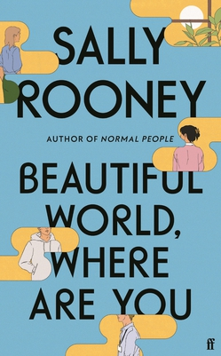

<strong>Year:</strong> 2021 <strong>Country:</strong> 🇮🇪 Ireland 

<button id="contemporary_fiction" class="badge bg-primary rounded-pill border-0" onclick="toggleTag(this, 'contemporary_fiction')">Contemporary Fiction</button>

## Scott Sigler - Aliens: Phalanx{.book .science_fiction .horror .space data-country="United States" data-rating="9" data-year="2020" data-title="Aliens: Phalanx" data-author="Scott Sigler"}

<strong>Year:</strong> 2020 <strong>Country:</strong> 🇺🇸 United States 

<button id="science_fiction" class="badge bg-primary rounded-pill border-0" onclick="toggleTag(this, 'science_fiction')">Science Fiction</button><button id="horror" class="badge bg-primary rounded-pill border-0" onclick="toggleTag(this, 'horror')">Horror</button><button id="space" class="badge bg-primary rounded-pill border-0" onclick="toggleTag(this, 'space')">Space</button>

## Susan Abulhawa - Against the Loveless World{.book .book_club .literary_fiction data-country="United Kingdom" data-rating="8" data-year="2019" data-title="Against the Loveless World" data-author="Susan Abulhawa"}

<strong>Year:</strong> 2019 <strong>Country:</strong> 🇬🇧 United Kingdom 

<button id="book_club" class="badge bg-primary rounded-pill border-0" onclick="toggleTag(this, 'book_club')">Book Club</button><button id="literary_fiction" class="badge bg-primary rounded-pill border-0" onclick="toggleTag(this, 'literary_fiction')">Literary Fiction</button>

## Adrian Tchaikovsky - Children of Time{.book .science_fiction .space data-country="United Kingdom" data-rating="10" data-year="2015" data-title="Children of Time" data-author="Adrian Tchaikovsky"}

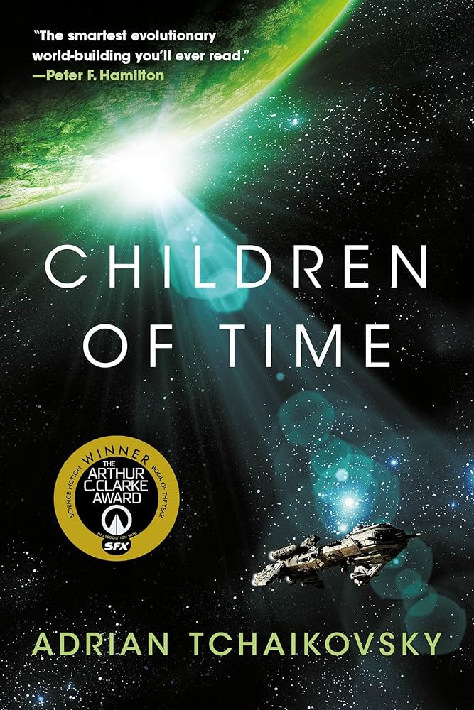

<strong>Year:</strong> 2015 <strong>Country:</strong> 🇬🇧 United Kingdom 

<button id="science_fiction" class="badge bg-primary rounded-pill border-0" onclick="toggleTag(this, 'science_fiction')">Science Fiction</button><button id="space" class="badge bg-primary rounded-pill border-0" onclick="toggleTag(this, 'space')">Space</button>

## Elif Shafak - Honour{.book .book_club .literary_fiction data-country="Turkey" data-rating="8" data-year="2012" data-title="Honour" data-author="Elif Shafak"}

<strong>Year:</strong> 2012 <strong>Country:</strong> 🇹🇷 Turkey 

<button id="book_club" class="badge bg-primary rounded-pill border-0" onclick="toggleTag(this, 'book_club')">Book Club</button><button id="literary_fiction" class="badge bg-primary rounded-pill border-0" onclick="toggleTag(this, 'literary_fiction')">Literary Fiction</button>

## Joseph Boyden - Three Day Road{.book .historical_fiction .war data-country="Canada" data-rating="8" data-year="2005" data-title="Three Day Road" data-author="Joseph Boyden"}

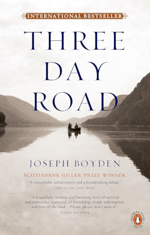

<strong>Year:</strong> 2005 <strong>Country:</strong> 🇨🇦 Canada 

<button id="historical_fiction" class="badge bg-primary rounded-pill border-0" onclick="toggleTag(this, 'historical_fiction')">Historical Fiction</button><button id="war" class="badge bg-primary rounded-pill border-0" onclick="toggleTag(this, 'war')">War</button>

## China Miéville - The Scar{.book .new_weird .fantasy .steampunk data-country="United Kingdom" data-rating="10" data-year="2004" data-title="The Scar" data-author="China Miéville"}

<strong>Year:</strong> 2004 <strong>Country:</strong> 🇬🇧 United Kingdom 

<button id="new_weird" class="badge bg-primary rounded-pill border-0" onclick="toggleTag(this, 'new_weird')">New Weird</button><button id="fantasy" class="badge bg-primary rounded-pill border-0" onclick="toggleTag(this, 'fantasy')">Fantasy</button><button id="steampunk" class="badge bg-primary rounded-pill border-0" onclick="toggleTag(this, 'steampunk')">Steampunk</button>

## China Miéville - Perdido Street Station{.book .new_weird .fantasy .horror .steampunk data-country="United Kingdom" data-rating="10" data-year="2000" data-title="Perdido Street Station" data-author="China Miéville"}

<strong>Year:</strong> 2000 <strong>Country:</strong> 🇬🇧 United Kingdom 

<button id="new_weird" class="badge bg-primary rounded-pill border-0" onclick="toggleTag(this, 'new_weird')">New Weird</button><button id="fantasy" class="badge bg-primary rounded-pill border-0" onclick="toggleTag(this, 'fantasy')">Fantasy</button><button id="horror" class="badge bg-primary rounded-pill border-0" onclick="toggleTag(this, 'horror')">Horror</button><button id="steampunk" class="badge bg-primary rounded-pill border-0" onclick="toggleTag(this, 'steampunk')">Steampunk</button>

## Mark Z. Danielewski - House of Leaves{.book .horror .postmodernism data-country="United States" data-rating="8" data-year="2000" data-title="House of Leaves" data-author="Mark Z. Danielewski"}

<strong>Year:</strong> 2000 <strong>Country:</strong> 🇺🇸 United States 

<button id="horror" class="badge bg-primary rounded-pill border-0" onclick="toggleTag(this, 'horror')">Horror</button><button id="postmodernism" class="badge bg-primary rounded-pill border-0" onclick="toggleTag(this, 'postmodernism')">Postmodernism</button>

## Haruki Murakami - The Wind-Up Bird Chronicle{.book .magical_realism data-country="Japan" data-rating="9" data-year="1997" data-title="The Wind-Up Bird Chronicle" data-author="Haruki Murakami"}

<strong>Year:</strong> 1997 <strong>Country:</strong> 🇯🇵 Japan 

<button id="magical_realism" class="badge bg-primary rounded-pill border-0" onclick="toggleTag(this, 'magical_realism')">Magical Realism</button>

## Kazuo Ishiguo - The Remains of the Day{.book .literary_fiction data-country="United Kingdom" data-rating="9" data-year="1989" data-title="The Remains of the Day" data-author="Kazuo Ishiguo"}

<strong>Year:</strong> 1989 <strong>Country:</strong> 🇬🇧 United Kingdom 

<button id="literary_fiction" class="badge bg-primary rounded-pill border-0" onclick="toggleTag(this, 'literary_fiction')">Literary Fiction</button>

## Octavia Butler - Kindred{.book .historical_fiction .low_fantasy data-country="United States" data-rating="9" data-year="1979" data-title="Kindred" data-author="Octavia Butler"}

<strong>Year:</strong> 1979 <strong>Country:</strong> 🇺🇸 United States 

<button id="historical_fiction" class="badge bg-primary rounded-pill border-0" onclick="toggleTag(this, 'historical_fiction')">Historical Fiction</button><button id="low_fantasy" class="badge bg-primary rounded-pill border-0" onclick="toggleTag(this, 'low_fantasy')">Low Fantasy</button>

## Douglas Adams - The Hitchhiker’s Guide to the Galaxy{.book .science_fiction .comedy .space data-country="United Kingdom" data-rating="8" data-year="1979" data-title="The Hitchhiker’s Guide to the Galaxy" data-author="Douglas Adams"}

<strong>Year:</strong> 1979 <strong>Country:</strong> 🇬🇧 United Kingdom 

<button id="science_fiction" class="badge bg-primary rounded-pill border-0" onclick="toggleTag(this, 'science_fiction')">Science Fiction</button><button id="comedy" class="badge bg-primary rounded-pill border-0" onclick="toggleTag(this, 'comedy')">Comedy</button><button id="space" class="badge bg-primary rounded-pill border-0" onclick="toggleTag(this, 'space')">Space</button>

## Italo Calvino - If on a winter's night a traveler{.book .postmodernism data-country="Italy" data-rating="8" data-year="1979" data-title="If on a winter's night a traveler" data-author="Italo Calvino"}

<strong>Year:</strong> 1979 <strong>Country:</strong> 🇮🇹 Italy 

<button id="postmodernism" class="badge bg-primary rounded-pill border-0" onclick="toggleTag(this, 'postmodernism')">Postmodernism</button>

## Ursula K. Le Guin - The Dispossessed (An Ambiguous Utopia){.book .science_fiction .political_fiction .space data-country="United States" data-rating="10" data-year="1974" data-title="The Dispossessed (An Ambiguous Utopia)" data-author="Ursula K. Le Guin"}

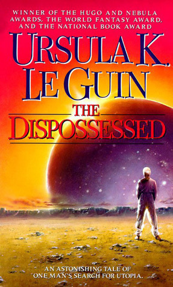

<strong>Year:</strong> 1974 <strong>Country:</strong> 🇺🇸 United States 

<button id="science_fiction" class="badge bg-primary rounded-pill border-0" onclick="toggleTag(this, 'science_fiction')">Science Fiction</button><button id="political_fiction" class="badge bg-primary rounded-pill border-0" onclick="toggleTag(this, 'political_fiction')">Political Fiction</button><button id="space" class="badge bg-primary rounded-pill border-0" onclick="toggleTag(this, 'space')">Space</button>

## Mikhail Bulgakov - The Master and Margarita{.book .magical_realism data-country="Soviet Union" data-rating="10" data-year="1973" data-title="The Master and Margarita" data-author="Mikhail Bulgakov"}

<strong>Year:</strong> 1973 <strong>Country:</strong> 🇸🇺 Soviet Union 

<button id="magical_realism" class="badge bg-primary rounded-pill border-0" onclick="toggleTag(this, 'magical_realism')">Magical Realism</button>

## Arthur C. Clake - Rendezvous with Rama{.book .science_fiction .space data-country="United Kingdom" data-rating="8" data-year="1973" data-title="Rendezvous with Rama" data-author="Arthur C. Clake"}

<strong>Year:</strong> 1973 <strong>Country:</strong> 🇬🇧 United Kingdom 

<button id="science_fiction" class="badge bg-primary rounded-pill border-0" onclick="toggleTag(this, 'science_fiction')">Science Fiction</button><button id="space" class="badge bg-primary rounded-pill border-0" onclick="toggleTag(this, 'space')">Space</button>

## Italo Calvino - Invisible Cities{.book .postmodernism .magical_realism data-country="Italy" data-rating="9" data-year="1972" data-title="Invisible Cities" data-author="Italo Calvino"}

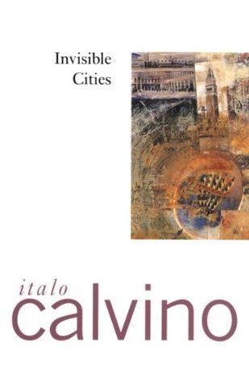

<strong>Year:</strong> 1972 <strong>Country:</strong> 🇮🇹 Italy 

<button id="postmodernism" class="badge bg-primary rounded-pill border-0" onclick="toggleTag(this, 'postmodernism')">Postmodernism</button><button id="magical_realism" class="badge bg-primary rounded-pill border-0" onclick="toggleTag(this, 'magical_realism')">Magical Realism</button>

## Ursula K. Le Guin - The Lathe of Heaven{.book .science_fiction data-country="United States" data-rating="8" data-year="1971" data-title="The Lathe of Heaven" data-author="Ursula K. Le Guin"}

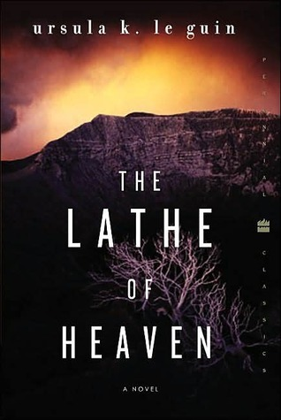

<strong>Year:</strong> 1971 <strong>Country:</strong> 🇺🇸 United States 

<button id="science_fiction" class="badge bg-primary rounded-pill border-0" onclick="toggleTag(this, 'science_fiction')">Science Fiction</button>

## Ursula K. Le Guin - The Left Hand of Darkness{.book .science_fiction .space data-country="United States" data-rating="9" data-year="1969" data-title="The Left Hand of Darkness" data-author="Ursula K. Le Guin"}

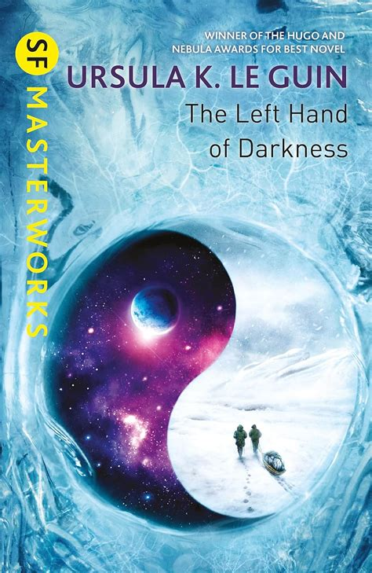

<strong>Year:</strong> 1969 <strong>Country:</strong> 🇺🇸 United States 

<button id="science_fiction" class="badge bg-primary rounded-pill border-0" onclick="toggleTag(this, 'science_fiction')">Science Fiction</button><button id="space" class="badge bg-primary rounded-pill border-0" onclick="toggleTag(this, 'space')">Space</button>

## Philip K. Dick - Ubik{.book .science_fiction data-country="United States" data-rating="8" data-year="1969" data-title="Ubik" data-author="Philip K. Dick"}

<strong>Year:</strong> 1969 <strong>Country:</strong> 🇺🇸 United States 

<button id="science_fiction" class="badge bg-primary rounded-pill border-0" onclick="toggleTag(this, 'science_fiction')">Science Fiction</button>

## Ursula K. Le Guin - A Wizard of Earthsea{.book .high_fantasy data-country="United States" data-rating="8" data-year="1968" data-title="A Wizard of Earthsea" data-author="Ursula K. Le Guin"}

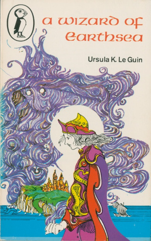

<strong>Year:</strong> 1968 <strong>Country:</strong> 🇺🇸 United States 

<button id="high_fantasy" class="badge bg-primary rounded-pill border-0" onclick="toggleTag(this, 'high_fantasy')">High Fantasy</button>

## Daniel Keyes - Flowers for Algernon{.book .science_fiction data-country="United States" data-rating="8" data-year="1966" data-title="Flowers for Algernon" data-author="Daniel Keyes"}

<strong>Year:</strong> 1966 <strong>Country:</strong> 🇺🇸 United States 

<button id="science_fiction" class="badge bg-primary rounded-pill border-0" onclick="toggleTag(this, 'science_fiction')">Science Fiction</button>

## Marlen Haushofer - The Wall{.book .low_fantasy data-country="Germany" data-rating="9" data-year="1963" data-title="The Wall" data-author="Marlen Haushofer"}

<strong>Year:</strong> 1963 <strong>Country:</strong> 🇩🇪 Germany 

<button id="low_fantasy" class="badge bg-primary rounded-pill border-0" onclick="toggleTag(this, 'low_fantasy')">Low Fantasy</button>

## Chinua Achebe - Things Fall Apart{.book .historical_fiction data-country="Nigeria" data-rating="8" data-year="1958" data-title="Things Fall Apart" data-author="Chinua Achebe"}

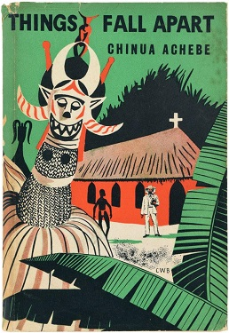

<strong>Year:</strong> 1958 <strong>Country:</strong> 🇳🇬 Nigeria 

<button id="historical_fiction" class="badge bg-primary rounded-pill border-0" onclick="toggleTag(this, 'historical_fiction')">Historical Fiction</button>

## Ray Bradbury - Fahrenheit 451{.book .dystopian data-country="United States" data-rating="8" data-year="1953" data-title="Fahrenheit 451" data-author="Ray Bradbury"}

<strong>Year:</strong> 1953 <strong>Country:</strong> 🇺🇸 United States 

<button id="dystopian" class="badge bg-primary rounded-pill border-0" onclick="toggleTag(this, 'dystopian')">Dystopian</button>

## Arthur C. Clake - Childhood’s End{.book .science_fiction .paranormal_fiction .space data-country="United Kingdom" data-rating="8" data-year="1953" data-title="Childhood’s End" data-author="Arthur C. Clake"}

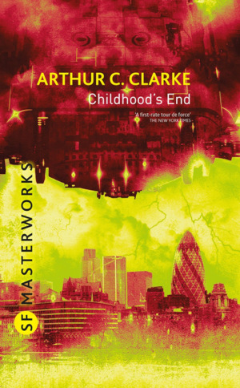

<strong>Year:</strong> 1953 <strong>Country:</strong> 🇬🇧 United Kingdom 

<button id="science_fiction" class="badge bg-primary rounded-pill border-0" onclick="toggleTag(this, 'science_fiction')">Science Fiction</button><button id="paranormal_fiction" class="badge bg-primary rounded-pill border-0" onclick="toggleTag(this, 'paranormal_fiction')">Paranormal Fiction</button><button id="space" class="badge bg-primary rounded-pill border-0" onclick="toggleTag(this, 'space')">Space</button>

## Fyodor Dostoevsky - Crime and Punishment{.book .literary_fiction .crime data-country="Russia" data-rating="9" data-year="1866" data-title="Crime and Punishment" data-author="Fyodor Dostoevsky"}

<strong>Year:</strong> 1866 <strong>Country:</strong> 🇷🇺 Russia 

<button id="literary_fiction" class="badge bg-primary rounded-pill border-0" onclick="toggleTag(this, 'literary_fiction')">Literary Fiction</button><button id="crime" class="badge bg-primary rounded-pill border-0" onclick="toggleTag(this, 'crime')">Crime</button>

## Charlotte Brontë - Jane Eyre{.book .gothic .bildungsroman data-country="United Kingdom" data-rating="8" data-year="1847" data-title="Jane Eyre" data-author="Charlotte Brontë"}

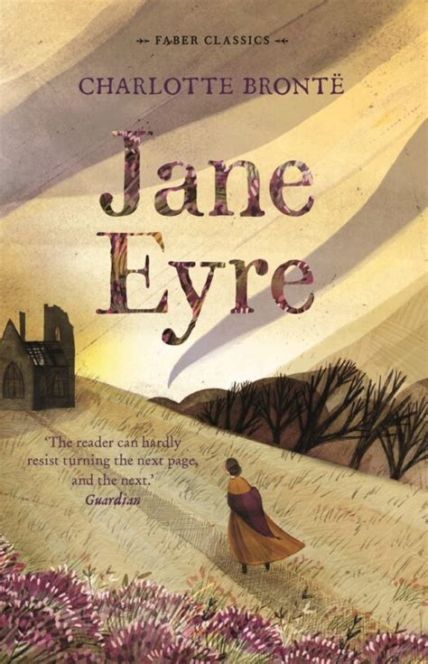

<strong>Year:</strong> 1847 <strong>Country:</strong> 🇬🇧 United Kingdom 

<button id="gothic" class="badge bg-primary rounded-pill border-0" onclick="toggleTag(this, 'gothic')">Gothic</button><button id="bildungsroman" class="badge bg-primary rounded-pill border-0" onclick="toggleTag(this, 'bildungsroman')">Bildungsroman</button>

## Mary Shelley - Frankenstein; or, The Modern Prometheus{.book .gothic .horror .science_fiction data-country="United Kingdom" data-rating="8" data-year="1818" data-title="Frankenstein; or, The Modern Prometheus" data-author="Mary Shelley"}

<strong>Year:</strong> 1818 <strong>Country:</strong> 🇬🇧 United Kingdom 

<button id="gothic" class="badge bg-primary rounded-pill border-0" onclick="toggleTag(this, 'gothic')">Gothic</button><button id="horror" class="badge bg-primary rounded-pill border-0" onclick="toggleTag(this, 'horror')">Horror</button><button id="science_fiction" class="badge bg-primary rounded-pill border-0" onclick="toggleTag(this, 'science_fiction')">Science Fiction</button>

 

