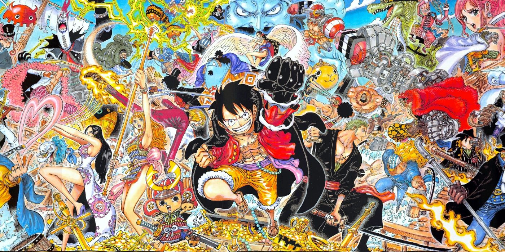
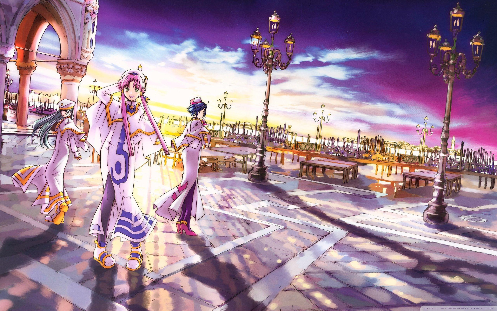
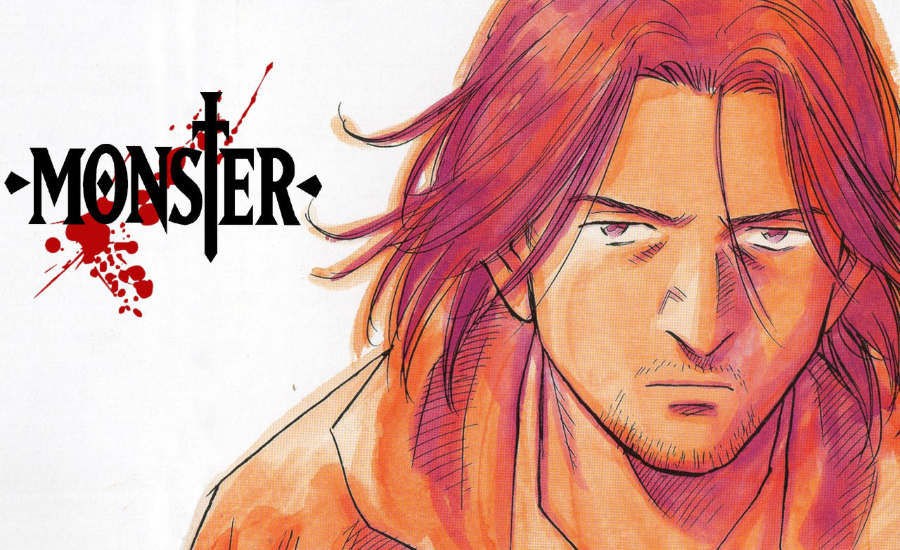

Work in progress! By no means exhaustive.

## One Piece

**Author:** Eiichiro Oda \
**Released:** 1995 - present \
**Chapters:** 1173+ as of February 2026 \
**Genres:** Adventure, Fantasy, Action, Comedy \

{fig-alt="Backdrop: One Piece" fig-align="center" width=100%}

<i>"I don't want to rule anything. Being King of the Pirates is about being more free than anyone."</i>

**Synopsis:**

In the time known as the Great Pirate Era, countless pirates go to battle across the seas in search of the *One Piece*: a legendary treasure left behind by Gold Roger, King of the Pirates. Monkey D. Luffy, a boy whose body turned to rubber after eating one of the mythic *Devil Fruits*, set sail to become the next King of the Pirates. As Luffy and his crew conquer numerous obstacles, they capture the unwanted attention of the imperialist World Government, which will use any means necessary to stop them.

**Why it's great:**

A sprawling, shamelessly romantic pirate odyssey that not only dares to dream big but very much insists on it, One Piece brims with exotic worlds, infectious camaraderie, endless hijinks, a palpable libertarian ethos (no, not the bad kind), and hard-hitting emotional highs that elevate the series from momentary entertainment to a treasure trove of fond memories living rent-free in your head forever. With a continuous, ongoing story developed over 25+ years and told in over 1100 chapters, all culminating towards a grand conclusion that has been cooking up in author Eiichiro Oda's endlessly imaginative mind since the very first chapter, there is truly no comparable storytelling experience I know of. No wonder that One Piece has accrued a massive, global fanbase throughout its run, consisting of veterans who grew up with the story as well as new generations of fans who have [adopted the One Piece pirate flag as a symbol of liberation across a global protest movement](https://www.theguardian.com/world/2025/sep/24/how-one-piece-manga-flag-became-symbol-asia-gen-z-protest-movement-liberation) (see below for an example captured by me). As far as long-form narrative fiction is concerned, once you've boarded the "Going Merry" and hoisted up that Jolly Roger flag yourself, you're in for an adventure of a lifetime!

{fig-alt="One Piece Jolly Roger flag spotted in the Swiss alps at the WEF protest march" fig-align="center" width=100%}

::: {.callout-warning collapse="true"}
## Caveats

Although the series can be very funny when its jokes land, overall it relies too heavily on slapstick humour for my tastes (this is espcially pronouced in the anime adaptation). More worryingly, the female character designs get increasingly gratuitous over time, which is a shame since the actual writing of the female characters can be very strong and miles ahead of genre peers where female charactes often serve primarily as romantic interest for the male characters. There are also a handful of moments where its representation of queer and trans characters can be rather humiliating, but this is more than made up for in later arcs, when the story becomes very explicitly a massive pro-LGBTQ ally (which is in line with the theme of diversity as strength at the heart of the story).
:::

::: {.callout-note collapse="true"}
## Does it have an anime adaptation?

Yes, but it's not without issues. The pacing is overall considerably worse compared to the manga, and the production quality can be inconsistent, though generally getting better over time. However, at its best, the adaptation offers many standout moments that elevate the source material to even greater heights. Toei Animation, the studio behind the adapation, really went all out in some of the later arcs, hiring a barrage of industry-leading animators (and discovering generational talents such as episode director [Megumi Ishitani](https://blog.sakugabooru.com/2022/04/30/the-meteoric-ascent-of-megumi-ishitani-toei-animations-new-heir/)) to do justice to some of the story's most climactic moments.
:::

## Aria

**Author:** Kozue Amano \
**Released:** 2001-2008 \
**Chapters:** 77 (note that the first 10 chapters were released under the name Aqua) \
**Genres:** Slice of Life, Iyashikei, Science Fiction, Magical Realism \

{fig-alt="Backdrop: Aria" fig-align="center" width=100%}

<i>"I like Aqua and Neo-Venezia. The inconvenience, the slow-moving time… All of it. The city is made of miracles."</i>

**Synopsis:**

Three aspiring gondoliers become friends in the dazzling city of Neo-Venezia, a replica of Venice built on a terraformed Mars that is completely covered in water.

**Why it's great:**

Aria is a gentle, elegant slice of life masterpiece that never fails to imbue me with a radiant sense of warmth and joy. A few chapters of this can be a perfect way to close out an exhausting day, when you just want to slowly drift into a peaceful, optimistic world with kind (and occasionally mischievous) characters. The story has virtually zero drama or external conflict; it's all about atmosphere, character interactions, and the uniquely beautiful setting of Neo-Venezia and its labyrinthine network of mysterious waterways and dazzling Gothic architecture. In addition, author Kozue Amano draws upon a rich mix of real Venetian culture with occasional sci-fi and magical realist elements to keep her episodic storytelling fresh. The illustrations are gorgeous too, especially the stunning double-page spreads that made me continually re-discover the city with new eyes.

::: {.callout-warning collapse="true"}
## Caveats

Although Aria is a piece of utopian fiction that presents a stirring vision of a kinder future, this vision operates largely on a vibes basis. Unfortunately, Kozue Amano's political imagination is somewhat half-baked, and the world of Neo-Venezia features a few questionable aspects that go unexamined. Most notably, women are not allowed in any occupations that require rowing boats, other than as undines (tourist guides). This is only mentioned in passing in the first chapter, but it is indicative of a wider sense of political underdevelopment. There are still interesting political implications in the worldbuilding of Aria, for example, the rejection of a growth-oriented economy built around consumerist conveniences. Nonetheless, for a more nuanced and politically conscious example of utopian fiction, see Ursula K. Le Guin's anarchist science fiction novel *The Dispossessed* (1974).
:::

::: {.callout-note collapse="true"}
## Does it have an anime adaptation?

Yes, it has a fairly strong adaptation, but the manga is still superior. Early seasons of the anime look quite dated and only exist in SD quality (or upscaled HD), as they were produced during the industry's bumpy transition from analog to digital production. For the ultimate Aria experience, I recommend reading the manga while listening to the anime's beautiful, Brazil-inspired [soundtrack](https://www.youtube.com/watch?v=daJISsWuWRI)!
:::

## Vinland Saga

**Author:** Makoto Yukimura \
**Released:** 2005 - present \
**Chapters:** 220 as of September 2025 \
**Genres:** Historical, Drama, Coming of Age, Adventure, Action \

{fig-alt="Backdrop: Vinland Saga" fig-align="center" width=100%}

<i>"Far to the west... across the sea... there is a place... called Vinland. It is warm and fertile... far from slavery and the fires of war. No one can reach you there. What do you say...? Will you live there with us?"</i>

**Synopsis:**

Thorfinn is a young Viking boy who has been raised in the shadow of his father Thors, a legendary warrior who abandond his violent past to live a peaceful life with his family. When tragedy strikes early in Thorfinn's life, he embarks on a quest for revenge that takes him across the treacherous seas of the North Atlantic and into the heart of Viking society.

**Why it's great:**

This story starts out as a bloody violent Viking revenge tale, but astute readers may pick up on early signs hinting that Makoto Yukimura's ambitions lie far beyond gory spectacle. The first part is essentially a lengthy prologue that serves to set up a massive character arc undertaken by our protagonist Thorfinn, who we follow from early childhood into adulthood. Without going into spoilers, all I will say is that, with Vinland Saga, Yukimura has confidently cemented himself as one the medium's premier champions of humanist, pacifist, and abolitionist ideals. Thorfinn's path cuts deep and is filled with unimaginable pain and suffering, but Yukimura's exploration of the darkest aspects of humanity is conducted with sensitivity and care, and he urges us to face the future with the determination to make it a place worth living in.

::: {.callout-note collapse="true"}
## Does it have an anime adaptation?

Yes, and it's very good, though only covering the first 100 chapters as of the latest season (released 2023). You can go with either the manga or the anime.
:::

## Monster

**Author:** Naoki Urasawa \
**Released:** 1994-2001 \
**Chapters:** 162 \
**Genres:** Psychological Thriller, Crime, Mystery

{fig-alt="Backdrop: Monster" fig-align="center" width=100%}

**Synopsis:**

Dr. Kenzo Tenma is a brilliant and conscientious young neurosurgeon from Japan who works in West Germany before the fall of the wall. Though exceptionally skilled, he remains naive to the cold realities of hospital politics, and soon gets confronted with difficult personal and moral dilemmas when directed by leadership to prioritise high-profile patients. Things turn for the worst when he realizes that one of his former patients whose life he once saved has turned into a remorseless serial killer…

**Why it's great:**

A masterclass in building and maintaining suspense, intrigue, and a chilling atmosphere. The ending to the main serial killer mystery may not satisfy everyone, but I would say this is a case where the journey comfortably outweighs the destination. The supporting cast and their individual stories add a lot of depth to the narrative, and Dr. Tenma is a protagonist who's hard not to root for.

::: {.callout-note collapse="true"}
## Does it have an anime adaptation?

Yes. I only watched a few episodes, but it seems to be a very accurate, almost shot-for-shot adaptation. You can probably go with either option.
:::