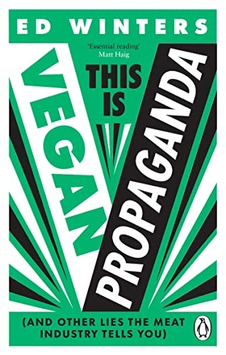
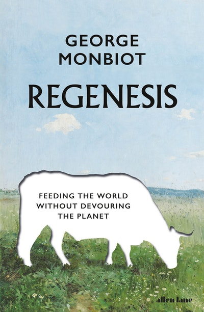
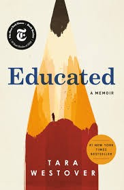
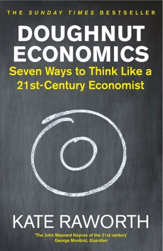
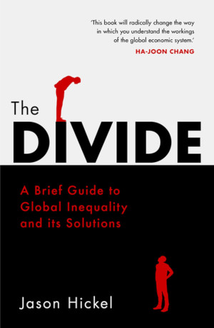
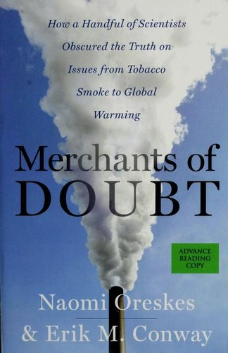

Work in progress! I'm planning to revisit many of these books and condense their most valuable insights here.\

::: {.callout-note title="Notes"}
- Click on a Tag to filter the list!
:::

  <button class="btn btn-primary dropdown-toggle" type="button"
          data-bs-toggle="dropdown" aria-expanded="false">
    Sort
  </button>
  <ul class="dropdown-menu">
    <li>
      <a class="dropdown-item" href="#"
         onclick="sortSections('rating','desc'); return false;">
        Rating
      </a>
    </li>
    <li>
      <a class="dropdown-item" href="#"
         onclick="sortSections('title','asc',false); return false;">
        Title
      </a>
    </li>
    <li>
      <a class="dropdown-item" href="#"
         onclick="sortSections('author','asc',false); return false;">
        Author
      </a>
    </li>
    <li>
      <a class="dropdown-item" href="#"
         onclick="sortSections('year','asc'); return false;">
        Year
      </a>
    </li>
  </ul>

 

## Naomi Klein - Doppelganger{.book .personal_favorite data-country="nan" data-rating="10" data-year="2023" data-title="Doppelganger" data-author="Naomi Klein"}

<strong>Subtitle</strong>: A Trip into the Mirror World <strong>Year:</strong> 2023 <strong>Genres:</strong> Memoir, Politics <strong>Verdict:</strong> 10/10 

<button id="personal_favorite" class="badge bg-primary rounded-pill border-0" onclick="toggleTag(this, 'personal_favorite')">❤️ Personal Favorite</button>

::: {.callout-note collapse="true" title="Notes"}

Brilliant memoir and insightful analysis of the resurgence of the far-right in the West. Of particular importance is the way that far-right politics co-opts leftist talking points and twists them to serve reactionary ends. Sadly, this is not a new story: divide and conquer is the oldest trick in the oligarch's playbook, promising minor economic concessions to the in-group while taking advantage of rising far-right sentiments to keep regular people in a constant state of manufactured hysteria about 'the Other'. What is new, however, is the way that social media has completely turbo-charged the spread of misinformation and the powerful allure of conspiracy theories, making it easier than ever to divert working-class resentment towards the latest scapegoat du jour. For a discussion of the book, see also <a target='_blank' rel='noopener noreferrer' href='https://www.youtube.com/watch?v=FxQ3EuEAOz0'>Ash Sarkar's interview with Naomi Klein</a> for Novara Media. Another crucial read is Klein's follow-up essay <a target='_blank' rel='noopener noreferrer' href='https://www.theguardian.com/us-news/ng-interactive/2025/apr/13/end-times-fascism-far-right-trump-musk'>The Rise of End Times Fascism</a>, co-written with Astra Taylor for The Guardian.

:::

## Ed Winters - This Is Vegan Propaganda{.book .essential_reading data-country="nan" data-rating="9" data-year="2022" data-title="This Is Vegan Propaganda" data-author="Ed Winters"}

<strong>Subtitle</strong>: (And Other Lies the Meat Industry Tells You) <strong>Year:</strong> 2022 <strong>Genres:</strong> Ethics, Health, Environment <strong>Verdict:</strong> 9/10 

<button id="essential_reading" class="badge bg-primary rounded-pill border-0" onclick="toggleTag(this, 'essential_reading')">⭐ Essential Reading</button>

::: {.callout-note collapse="true" title="Notes"}

A comprehensive overview making the case for (you guessed it) veganism. Covers most of the important topics: ethics and animal welfare, environment and climate, nutrition and health, and countering the prevailing narrative. Winters also runs a successful YouTube channel under the name [Earthling Ed](https://www.youtube.com/@ed.winters/videos), featuring a mix of commentary videos and debates where he (amicably) dismantles his interlocutors’ arguments with ease. His [university speech](https://www.youtube.com/watch?v=Z3u7hXpOm58) serves as an excellent introduction to veganism.

:::

## George Monbiot - Regenesis{.book .essential_reading data-country="nan" data-rating="10" data-year="2022" data-title="Regenesis" data-author="George Monbiot"}

<strong>Subtitle</strong>: Feeding the World Without Devouring the Planet <strong>Year:</strong> 2022 <strong>Genres:</strong> Environment <strong>Verdict:</strong> 10/10 

<button id="essential_reading" class="badge bg-primary rounded-pill border-0" onclick="toggleTag(this, 'essential_reading')">⭐ Essential Reading</button>

::: {.callout-note collapse="true" title="Notes"}

The challenge posed in this book's title is undoubtedly of monumental importance to us all, though sadly it doesn't get anywhere near the amount of attention it deserves. How can we achieve high-yield, low-impact foods that are healthy, sustainable, universally accessible, and don't leave us vulnerable to systemic shocks, corporate monopolization, and the existential threats of multiple transgressed <a href='https://pdegen.github.io/pdegen/advocacy#climate' target='_blank' rel='noopener noreferrer' >planetary boundaries</a>? George Monbiot's <i>Regenesis</i> is an urgent and extensively referenced contribution to this challenge, offering empirically grounded and politically incisive analysis driven by a deep and palpable love for the living world.  Topics discussed include: 1) the importance of soil ecology and the degree to which it is still understudied; 2) agricultural sprawl and the rise of the 'Global Standard Farm' as arguably the most ecologically destructive force on the planet—politically sustained by corporate lobbying and perverse agricultural subsidies, and culturally reinforced by the enduring myth of the pastoral idyll; 3) a complex systems perspective highlighting the vulnerability of tightly connected, monopolistic networks to systemic shocks—exemplified by the global food system; 4) the challenges and opportunities of the agroecology and food sovereignty movements, as well as food technologies such as precision fermentation, perennial crops, no-till farming, and more; 5) the importance of anti-trust laws and \"open source\" food technology to prevent corporate monopolization and regression to the business practices that got us into this mess in the first place; of ensuring that farmers working in destructive legacy industries are given the support to transition to greener ventures; of restoring ecosystems in the lands freed up by transitioning away from the bewildering wastefulness of dominant farming practices; and much more.  The wide range of topics covered reflects the reality that there are no panaceas—as Monbiot makes clear, every promising solution has its use cases and limitations, and the key to global food security will likely be a diversified mix of approaches tailored to local circumstances.

- Recommended further reading: <i>Doughnut Economics</i> by Kate Raworth; <i>This Is Vegan Propaganda</i> by Ed Winters.

:::

## Tara Westover - Educated{.book .personal_favorite data-country="nan" data-rating="10" data-year="2018" data-title="Educated" data-author="Tara Westover"}

<strong>Subtitle</strong>: nan <strong>Year:</strong> 2018 <strong>Genres:</strong> Memoir <strong>Verdict:</strong> 10/10 

<button id="personal_favorite" class="badge bg-primary rounded-pill border-0" onclick="toggleTag(this, 'personal_favorite')">❤️ Personal Favorite</button>

::: {.callout-note collapse="true" title="Notes"}

Powerful memoir chronicling the author's upbringing in an abusive, conspiratorial, hardcore survivalist Mormon household that denied her education and healthcare, and how she eventually escaped this environment. The book's focus on one horrifyingly dysfunctional family may seem like a window into life on the fringes of society, but to anybody who is paying attention to US politics at all, it will be hard not to see in this a microcosm of the paranoia and corrosive hyperindividualism that characterizes the dominant ideology imposed by the American ruling class...

:::

## Kate Raworth - Doughnut Economics{.book .essential_reading data-country="nan" data-rating="9" data-year="2017" data-title="Doughnut Economics" data-author="Kate Raworth"}

<strong>Subtitle</strong>: Seven Ways to Think Like a 21st-Century Economist <strong>Year:</strong> 2017 <strong>Genres:</strong> Economics <strong>Verdict:</strong> 9/10 

<button id="essential_reading" class="badge bg-primary rounded-pill border-0" onclick="toggleTag(this, 'essential_reading')">⭐ Essential Reading</button>

::: {.callout-note collapse="true" title="Notes"}

Ask an orthodox economist to sketch a figure of the ideal development of the economy and you'll likely get an exponentially growing GDP curve—truncated at some point for practical reasons, but implied to be chasing after infinity, forever. A triumphant story of eternal progress enabled by the powers of capitalism and the free market. However, after a hearty laugh you decide that \"line go up forever\" is not a satisfying answer, so you dare the economist to explicitly draw the asymptotic behavior of this curve with respect to time. It stands to reason that this line will have to plateau at some point. How do we know when that point is reached? What if we have already overshot the optimum plateau? <i>What even is the purpose of the economy?</i> 

For serious answers, you will have to look beyond the narrow confines of 20th century neoclassical economics and venture into the realm of political and heterodox economics, as exemplified by Kate Raworth in this book. Rather than advocating for strict degrowth like Jason Hickel (cf. <i>Less Is More</i>), Raworth advocates for a growth-agnostic economy that is distributive and regenerative by design. Crucially, the purpose of economic policy should be to balance the economy within the Goldilocks zone defined by two concentric circles: the inner circle represents the minimum level of economic development necessary to achieve universal human rights for all; the outer circle represents the maximum level of economic activity that can be sustained while keeping within the nine <a href='https://www.stockholmresilience.org/research/planetary-boundaries.html' target='_blank' rel='noopener noreferrer'>planetary boundaries</a> established by Earth systems science. I don't know about you, but this sounds much more appealing than the alternative of a burning planet ruled over by a tiny billionaire class telling the rest of us \"all is well, GDP grew by 1.2% this quarter, now please continue being distracted fighting amongst yourselves\".

- Recommended further reading: <i>Less Is More</i> by Jason Hickel; <i>Foundations of Economics</i> by Yanis Varoufakis.

- October 2025 Update: Now published as a <a href='https://www.nature.com/articles/s41586-025-09385-1' target='_blank' rel='noopener noreferrer'>paper</a> in Nature.

:::

## Jason Hickel - The Divide{.book .essential_reading data-country="nan" data-rating="10" data-year="2017" data-title="The Divide" data-author="Jason Hickel"}

<strong>Subtitle</strong>: A Brief Guide to Global Inequality and its Solutions <strong>Year:</strong> 2017 <strong>Genres:</strong> Politics, History, Economics <strong>Verdict:</strong> 10/10 

<button id="essential_reading" class="badge bg-primary rounded-pill border-0" onclick="toggleTag(this, 'essential_reading')">⭐ Essential Reading</button>

::: {.callout-note collapse="true" title="Notes"}

- A detailed, sobering account of all the different ways the Global North has used violence and coercion to protects its economic and political interests at the expense of the Global South.

- Challenges the popular myths that the Global South is underdeveloped due to natural causes, and that the Global North is benevolently helping to develop poor countries through foreign aid. In reality, the Global North extracts much more value out of poor countries than is invested though foreign aid.

- Means to achieve this extraction have shifted over time but generally include colonisation, wars, coups, structural adjustment programmes, unfair trade laws, restrictive patent laws, nefarious debt instruments, disproportionate power in international institutions, land grabs, privatisation, and enclosing commons like water and seeds.

- Recommended further reading: <i>The Myth of American Idealism</i> by Nathan J. Robinson and (the disgraced) Noam Chomsky.

:::

## Naomi Oreskes & Erik M. Conway - Merchants of Doubt{.book .essential_reading data-country="United States" data-rating="9" data-year="2010" data-title="Merchants of Doubt" data-author="Naomi Oreskes & Erik M. Conway"}

<strong>Subtitle</strong>: How a Handful of Scientists Obscured the Truth on Issues from Tobacco Smoke to Global Warming  <strong>Year:</strong> 2010 <strong>Genres:</strong> Politics, Science <strong>Verdict:</strong> 9/10 

<button id="essential_reading" class="badge bg-primary rounded-pill border-0" onclick="toggleTag(this, 'essential_reading')">⭐ Essential Reading</button>

::: {.callout-note collapse="true" title="Notes"}

If you're curious to learn how the US arrived at a place where <a target='_blank' rel='noopener noreferrer' href='https://climatecommunication.gmu.edu/all/climate-change-in-the-american-mind-beliefs-and-attitudes-fall-2024/'>a third of the population</a> is either unaware or outright denies the scientific consensus on anthropogenic climate change, this is the book to read. You may have heard before that <a target='_blank' rel='noopener noreferrer' href='https://www.scientificamerican.com/article/exxon-knew-about-climate-change-almost-40-years-ago/'>Exxon Mobile</a> was a key driver in obscuring their own private research on climate change and spending millions to sow doubt about the science among the general public. But did you know that the same playbook was used time and again, from the ozone hole to acid rain to the environmental impact of DDT pesticides, often spearheaded by the same handful of former scientists turned industry mouthpieces? The authors trace a lineage of corporate-sponsored doubt-mongering that goes all the way back to the 1950s, when tobacco companies obscured the emerging scientific and medical consensus on the link between smoking and lung cancer. Crucially, the book shows how science denial is deeply intertwined with Cold War hysteria and free market ideology, funded by the private sector and conservative think tanks like The Heritage Foundation—yes, the one behind Project 2025 and <a target='_blank' rel='noopener noreferrer' href='https://forward.com/opinion/676036/antisemitism-heritage-foundation-project-esther/'>Project Esther</a>. Hard to think of an organization with a more disastrous impact on the future of humanity...

- Recommended further reading: <i>Bad Science</i> by Ben Goldacre; <i>Why Trust Science?</i> by Naomi Oreskes.

:::

## Ben Goldacre - Bad Science{.book data-country="nan" data-rating="9" data-year="2008" data-title="Bad Science" data-author="Ben Goldacre"}

<strong>Subtitle</strong>: Quacks, Hacks, and Big Pharma Flacks <strong>Year:</strong> 2008 <strong>Genres:</strong> Science <strong>Verdict:</strong> 9/10 

::: {.callout-note collapse="true" title="Notes"}

Ben Goldacre is a physician and academic who wrote The Guardian's *Bad Science* column from 2003 until 2011, vigilantly debunking miracle cure peddlers, pseudoscientific claims, and the misleading sensationalism pervading mainstream science reporting. Goldacre's eponymous book is an important contribution to the urgent task of raising scientific literacy, effectively breaking down the basics of evidence-based medicine, cognitive biases, and statistical reasoning with clarity, humor, and an abundance of illustrative examples.

Sadly, this book's relevance has only skyrocketed since its first publication in 2008—two years after the peak of the British media's infamous MMR health scare. With the advancement of generative AI, the rise of social media influencers, and the fundamental brokenness of US politics finally reaching its logical end point as con men and crackpots like RFK Jr. and Elon Musk wreak havoc on the public, the examples given in this book seem almost quaint by comparison. Nonetheless, this book offers vital tools to steel the reader against quackery and [bullshitters](https://www.currentaffairs.org/news/2022/12/we-live-in-the-age-of-the-bullshitter) in the post-truth era.

- Recommended further reading: <i>Merchants of Doubt</i> by Naomi Oreskes and Erik M. Conway, <i>Foolproof</i> by Sander van der Linden.

:::

## To be added

- Csaba Szabo - Unreliable
- Omar El Akkad - One Day, Everyone Will Have Always Been Against This
- Fernando Racimo - Science in Resistance
- Genevieve Guenther - The Language of Climate Politics
- Nathan J. Robinson & Noam Chomsky - The Myth of American Idealism
- Matthew Desmond - Poverty, by America
- Sander van der Linden - Foolproof
- Adam Rutherford - Control
- China Miéville - A Spectre, Haunting
- Paris Marx - Road to Nowhere
- Jason Hickel - Less Is More
- Naomi Oreskes - Why Trust Science?
- Nathan J. Robinson - The Current Affairs Rules for Life
- Rob Larson - Capitalism vs. Freedom
- Jason Stanley - How Fascism Works
- Yanis Varoufakis - Adults in the Room
- Carlo Rovelli - Reality Is Not What It Seems
- Naomi Klein - This Changes Everything
- Richard D. Wolff - Democracy at Work
- Gabor Maté - In the Realm of Hungry Ghosts
- Julia Serano - Whipping Girl
- Lee Smolin - The Trouble with Physics
- David Harvey - A Brief History of Neoliberalism
- Silvia Federici - Caliban and the Witch
- Yanis Varoufakis - Foundations of Economics
- Michael Parenti - Blackshirts & Reds
- Murray Bookchin - Post-Scarcity Anarchism
- James Baldwin - The Fire Next Time
- Erich Fromm - The Art of Loving
- George Orwell - Homage to Catalonia
- Errico Malatesta - At the Café

 

