The greatest ablums of all time!!! (According to me)\


::: {.callout-note title="Note"}
- Work in progress...
- One album per artist.
- Classical releases are not eligible and will be covered in a separate list.
:::


<div class="dropdown">
  <button class="btn btn-primary dropdown-toggle" type="button"
          data-bs-toggle="dropdown" aria-expanded="false">
    Sort
  </button>
  <ul class="dropdown-menu">
    <li>
      <a class="dropdown-item" href="#"
         onclick="sortSections('rank','desc'); return false;">
        Rank
      </a>
    </li>
    <li>
      <a class="dropdown-item" href="#"
         onclick="sortSections('year','asc'); return false;">
        Year
      </a>
    </li>
    <li>
      <a class="dropdown-item" href="#"
         onclick="sortSections('country','asc',false); return false;">
        Country
      </a>
    </li>
  </ul>
</div>


<div class="albums">## 66. Sleater-Kinney - The Woods{.album data-country="USA" data-passion="0" data-dreamy="0" data-dark="0" data-groovy="0" data-angry="0" data-happy="0" data-sad="0" data-rank="66" data-year="2005"}
<div class="album-container"><div class="album-image">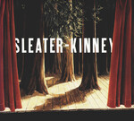</div><div class="album-info"><p class="mb-0"><strong>Year:</strong> 2005<br><strong>Country:</strong> 🇺🇸 USA<br><strong>Genres:</strong> Indie Rock<br><strong>Favorite Song: <a href="https://www.youtube.com/watch?v=MbxRu7fwR24" target="_blank" rel="noopener noreferrer">Entertain</a></strong></p></div></div><div class="toggle-tags"><div class="d-flex gap-2 mb-2 mt-2"></div></div>
## 65. Various Artists - Sonny Boy{.album .soundtrack data-country="Japan" data-passion="0" data-dreamy="0" data-dark="0" data-groovy="0" data-angry="0" data-happy="0" data-sad="0" data-rank="65" data-year="2021"}
<div class="album-container"><div class="album-image"></div><div class="album-info"><p class="mb-0"><strong>Year:</strong> 2021<br><strong>Country:</strong> 🇯🇵 Japan<br><strong>Genres:</strong> Alternative Rock<br><strong>Favorite Song: <a href="https://www.youtube.com/watch?v=HSDdRxAEdcs" target="_blank" rel="noopener noreferrer">Sonny Boy Rhapsody</a></strong></p></div></div><div class="toggle-tags"><div class="d-flex gap-2 mb-2 mt-2"><button id="soundtrack" class="badge bg-primary rounded-pill border-0" onclick="toggleTag(this, 'soundtrack')">Soundtrack</button></div></div>
## 64. PJ Harvey - Stories From the City, Stories From the Sea {.album data-country="United Kingdom" data-passion="0" data-dreamy="0" data-dark="0" data-groovy="0" data-angry="0" data-happy="0" data-sad="0" data-rank="64" data-year="2000"}
<div class="album-container"><div class="album-image">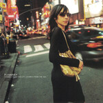</div><div class="album-info"><p class="mb-0"><strong>Year:</strong> 2000<br><strong>Country:</strong> 🇬🇧 United Kingdom<br><strong>Genres:</strong> Alternative Rock<br><strong>Favorite Song: <a href="https://www.youtube.com/watch?v=pY8n7uYT0mM" target="_blank" rel="noopener noreferrer">We Float</a></strong></p></div></div><div class="toggle-tags"><div class="d-flex gap-2 mb-2 mt-2"></div></div>
## 63. dälek - Absence{.album data-country="USA" data-passion="0" data-dreamy="0" data-dark="0" data-groovy="0" data-angry="0" data-happy="0" data-sad="0" data-rank="63" data-year="2005"}
<div class="album-container"><div class="album-image">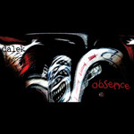</div><div class="album-info"><p class="mb-0"><strong>Year:</strong> 2005<br><strong>Country:</strong> 🇺🇸 USA<br><strong>Genres:</strong> Industrial Hip Hop, Abstract Hip Hop<br><strong>Favorite Song: <a href="https://www.youtube.com/watch?v=bflcOAfWH-Y" target="_blank" rel="noopener noreferrer">Distorted Pose</a></strong></p></div></div><div class="toggle-tags"><div class="d-flex gap-2 mb-2 mt-2"></div></div>
## 62. JunxPunx - Reminder{.album data-country="Japan" data-passion="0" data-dreamy="0" data-dark="0" data-groovy="0" data-angry="0" data-happy="0" data-sad="0" data-rank="62" data-year="2014"}
<div class="album-container"><div class="album-image"></div><div class="album-info"><p class="mb-0"><strong>Year:</strong> 2014<br><strong>Country:</strong> 🇯🇵 Japan<br><strong>Genres:</strong> Hi-Tech Psytrance<br><strong>Favorite Song: <a href="https://www.youtube.com/watch?v=l-OrSlDJVEo" target="_blank" rel="noopener noreferrer">Secret Girl</a></strong></p></div></div><div class="toggle-tags"><div class="d-flex gap-2 mb-2 mt-2"></div></div>
## 61. Snapcase - Progression Through Unlearning{.album .sound_of_the_revolution data-country="USA" data-passion="0" data-dreamy="0" data-dark="0" data-groovy="0" data-angry="0" data-happy="0" data-sad="0" data-rank="61" data-year="1997"}
<div class="album-container"><div class="album-image">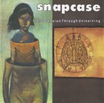</div><div class="album-info"><p class="mb-0"><strong>Year:</strong> 1997<br><strong>Country:</strong> 🇺🇸 USA<br><strong>Genres:</strong> Metalcore<br><strong>Favorite Song: <a href="https://www.youtube.com/watch?v=wb1byFx1wAk" target="_blank" rel="noopener noreferrer">Guilty by Ignorance</a></strong></p></div></div><div class="toggle-tags"><div class="d-flex gap-2 mb-2 mt-2"><button id="sound_of_the_revolution" class="badge bg-primary rounded-pill border-0" onclick="toggleTag(this, 'sound_of_the_revolution')">Sound of the Revolution</button></div></div>
## 60. Vangelis - Blade Runner{.album .soundtrack data-country="USA" data-passion="0" data-dreamy="0" data-dark="0" data-groovy="0" data-angry="0" data-happy="0" data-sad="0" data-rank="60" data-year="1980"}
<div class="album-container"><div class="album-image"></div><div class="album-info"><p class="mb-0"><strong>Year:</strong> 1980<br><strong>Country:</strong> 🇺🇸 USA<br><strong>Genres:</strong> Progressive Electronic<br><strong>Favorite Song: <a href="https://www.youtube.com/watch?v=u1KfOMkyU_w" target="_blank" rel="noopener noreferrer">Memories of Green</a></strong></p></div></div><div class="toggle-tags"><div class="d-flex gap-2 mb-2 mt-2"><button id="soundtrack" class="badge bg-primary rounded-pill border-0" onclick="toggleTag(this, 'soundtrack')">Soundtrack</button></div></div>
## 59. Gris - Il était une forêt{.album .gaze_into_the_abyss data-country="Canada" data-passion="0" data-dreamy="0" data-dark="0" data-groovy="0" data-angry="0" data-happy="0" data-sad="0" data-rank="59" data-year="2007"}
<div class="album-container"><div class="album-image">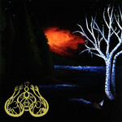</div><div class="album-info"><p class="mb-0"><strong>Year:</strong> 2007<br><strong>Country:</strong> 🇨🇦 Canada<br><strong>Genres:</strong> Depressive Black Metal<br><strong>Favorite Song: <a href="https://www.youtube.com/watch?v=rMrBWwEMA7w" target="_blank" rel="noopener noreferrer">Il était une forêt</a></strong></p></div></div><div class="toggle-tags"><div class="d-flex gap-2 mb-2 mt-2"><button id="gaze_into_the_abyss" class="badge bg-primary rounded-pill border-0" onclick="toggleTag(this, 'gaze_into_the_abyss')">Gaze Into the Abyss</button></div></div>
## 58. Tim Hecker - Konoyo{.album data-country="Canada" data-passion="0" data-dreamy="0" data-dark="0" data-groovy="0" data-angry="0" data-happy="0" data-sad="0" data-rank="58" data-year="2018"}
<div class="album-container"><div class="album-image"></div><div class="album-info"><p class="mb-0"><strong>Year:</strong> 2018<br><strong>Country:</strong> 🇨🇦 Canada<br><strong>Genres:</strong> Ambient, Drone, Gagaku<br><strong>Favorite Song: <a href="https://www.youtube.com/watch?v=90unmGG4eKI" target="_blank" rel="noopener noreferrer">This Life</a></strong></p></div></div><div class="toggle-tags"><div class="d-flex gap-2 mb-2 mt-2"></div></div>
## 57. Opeth - Blackwater Park{.album data-country="Sweden" data-passion="0" data-dreamy="0" data-dark="0" data-groovy="0" data-angry="0" data-happy="0" data-sad="0" data-rank="57" data-year="2001"}
<div class="album-container"><div class="album-image">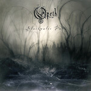</div><div class="album-info"><p class="mb-0"><strong>Year:</strong> 2001<br><strong>Country:</strong> 🇸🇪 Sweden<br><strong>Genres:</strong> Progressive Metal<br><strong>Favorite Song: <a href="https://www.youtube.com/watch?v=j4xCb_OU_lM" target="_blank" rel="noopener noreferrer">Blackwater Park</a></strong></p></div></div><div class="toggle-tags"><div class="d-flex gap-2 mb-2 mt-2"></div></div>
## 56. The Beatles - Abbey Road{.album data-country="United Kingdom" data-passion="0" data-dreamy="0" data-dark="0" data-groovy="0" data-angry="0" data-happy="0" data-sad="0" data-rank="56" data-year="1969"}
<div class="album-container"><div class="album-image">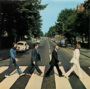</div><div class="album-info"><p class="mb-0"><strong>Year:</strong> 1969<br><strong>Country:</strong> 🇬🇧 United Kingdom<br><strong>Genres:</strong> Pop Rock<br><strong>Favorite Song: <a href="https://www.youtube.com/watch?v=GKdl-GCsNJ0" target="_blank" rel="noopener noreferrer">Here Comes the Sun</a></strong></p></div></div><div class="toggle-tags"><div class="d-flex gap-2 mb-2 mt-2"></div></div>
## 55. Barbara Dane - FTA!: Songs of the GI Resistance {.album .sound_of_the_revolution data-country="USA" data-passion="0" data-dreamy="0" data-dark="0" data-groovy="0" data-angry="0" data-happy="0" data-sad="0" data-rank="55" data-year="1970"}
<div class="album-container"><div class="album-image"></div><div class="album-info"><p class="mb-0"><strong>Year:</strong> 1970<br><strong>Country:</strong> 🇺🇸 USA<br><strong>Genres:</strong> Contemporary Folk<br><strong>Favorite Song: <a href="https://www.youtube.com/watch?v=YS1rSEnxgNE" target="_blank" rel="noopener noreferrer">Resistance Hymn</a></strong></p></div></div><div class="toggle-tags"><div class="d-flex gap-2 mb-2 mt-2"><button id="sound_of_the_revolution" class="badge bg-primary rounded-pill border-0" onclick="toggleTag(this, 'sound_of_the_revolution')">Sound of the Revolution</button></div></div>
## 54. Kow Otani - Haibane Renmei: Soundtrack Hanenone{.album .soundtrack .tears_please_stop_flowing data-country="Japan" data-passion="0" data-dreamy="0" data-dark="0" data-groovy="0" data-angry="0" data-happy="0" data-sad="0" data-rank="54" data-year="2003"}
<div class="album-container"><div class="album-image"></div><div class="album-info"><p class="mb-0"><strong>Year:</strong> 2003<br><strong>Country:</strong> 🇯🇵 Japan<br><strong>Genres:</strong> Chamber Musik<br><strong>Favorite Song: <a href="https://www.youtube.com/watch?v=36DgAT5jWMY" target="_blank" rel="noopener noreferrer">Refrain of Memory</a></strong></p></div></div><div class="toggle-tags"><div class="d-flex gap-2 mb-2 mt-2"><button id="soundtrack" class="badge bg-primary rounded-pill border-0" onclick="toggleTag(this, 'soundtrack')">Soundtrack</button><button id="tears_please_stop_flowing" class="badge bg-primary rounded-pill border-0" onclick="toggleTag(this, 'tears_please_stop_flowing')"> Tears Please Stop Flowing</button></div></div>
## 52. Yoshihiro Kanno - Angel’s Egg{.album .soundtrack .gaze_into_the_abyss data-country="Japan" data-passion="0" data-dreamy="0" data-dark="0" data-groovy="0" data-angry="0" data-happy="0" data-sad="0" data-rank="52" data-year="1985"}
<div class="album-container"><div class="album-image">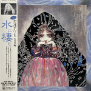</div><div class="album-info"><p class="mb-0"><strong>Year:</strong> 1985<br><strong>Country:</strong> 🇯🇵 Japan<br><strong>Genres:</strong> Modern Classical<br><strong>Favorite Song: <a href="https://www.youtube.com/watch?v=mqRR9EoWVAI" target="_blank" rel="noopener noreferrer">Prelude</a></strong></p></div></div><div class="toggle-tags"><div class="d-flex gap-2 mb-2 mt-2"><button id="soundtrack" class="badge bg-primary rounded-pill border-0" onclick="toggleTag(this, 'soundtrack')">Soundtrack</button><button id="gaze_into_the_abyss" class="badge bg-primary rounded-pill border-0" onclick="toggleTag(this, 'gaze_into_the_abyss')"> Gaze Into the Abyss</button></div></div>
## 51. Tyler, the Creator - Igor{.album data-country="USA" data-passion="0" data-dreamy="0" data-dark="0" data-groovy="0" data-angry="0" data-happy="0" data-sad="0" data-rank="51" data-year="2019"}
<div class="album-container"><div class="album-image">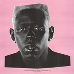</div><div class="album-info"><p class="mb-0"><strong>Year:</strong> 2019<br><strong>Country:</strong> 🇺🇸 USA<br><strong>Genres:</strong> Neo-Soul<br><strong>Favorite Song: <a href="https://www.youtube.com/watch?v=HmAsUQEFYGI" target="_blank" rel="noopener noreferrer">EARFQUAKE</a></strong></p></div></div><div class="toggle-tags"><div class="d-flex gap-2 mb-2 mt-2"></div></div>
## 50. Ninajirachi - I Love My Computer {.album data-country="United Kingdom" data-passion="0" data-dreamy="0" data-dark="0" data-groovy="0" data-angry="0" data-happy="0" data-sad="0" data-rank="50" data-year="2025"}
<div class="album-container"><div class="album-image">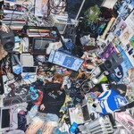</div><div class="album-info"><p class="mb-0"><strong>Year:</strong> 2025<br><strong>Country:</strong> 🇬🇧 United Kingdom<br><strong>Genres:</strong> Electrohouse<br><strong>Favorite Song: <a href="https://www.youtube.com/watch?v=p2ZdeIKJA8c" target="_blank" rel="noopener noreferrer">Infohazard</a></strong></p></div></div><div class="toggle-tags"><div class="d-flex gap-2 mb-2 mt-2"></div></div>
## 49. Weyes Blood - Titanic Rising{.album data-country="USA" data-passion="0" data-dreamy="0" data-dark="0" data-groovy="0" data-angry="0" data-happy="0" data-sad="0" data-rank="49" data-year="2019"}
<div class="album-container"><div class="album-image">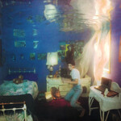</div><div class="album-info"><p class="mb-0"><strong>Year:</strong> 2019<br><strong>Country:</strong> 🇺🇸 USA<br><strong>Genres:</strong> Psychedelic Pop<br><strong>Favorite Song: <a href="https://www.youtube.com/watch?v=ZHGw78IJryE" target="_blank" rel="noopener noreferrer">Andromeda</a></strong></p></div></div><div class="toggle-tags"><div class="d-flex gap-2 mb-2 mt-2"></div></div>
## 48. toe - For Long Tomorrow{.album data-country="Japan" data-passion="0" data-dreamy="0" data-dark="0" data-groovy="0" data-angry="0" data-happy="0" data-sad="0" data-rank="48" data-year="2009"}
<div class="album-container"><div class="album-image"></div><div class="album-info"><p class="mb-0"><strong>Year:</strong> 2009<br><strong>Country:</strong> 🇯🇵 Japan<br><strong>Genres:</strong> Post-Rock, Midwest Emo<br><strong>Favorite Song: <a href="https://www.youtube.com/watch?v=e1pZIfretEs" target="_blank" rel="noopener noreferrer">Goodbye</a></strong></p></div></div><div class="toggle-tags"><div class="d-flex gap-2 mb-2 mt-2"></div></div>
## 47. Lorien Testard - Clair Obscur: Expedition 33 {.album .soundtrack data-country="France" data-passion="0" data-dreamy="0" data-dark="0" data-groovy="0" data-angry="0" data-happy="0" data-sad="0" data-rank="47" data-year="2025"}
<div class="album-container"><div class="album-image"></div><div class="album-info"><p class="mb-0"><strong>Year:</strong> 2025<br><strong>Country:</strong> 🇫🇷 France<br><strong>Genres:</strong> Classical Crossover<br><strong>Favorite Song: <a href="https://www.youtube.com/watch?v=yakOBIoyoik" target="_blank" rel="noopener noreferrer">Alicia</a></strong></p></div></div><div class="toggle-tags"><div class="d-flex gap-2 mb-2 mt-2"><button id="soundtrack" class="badge bg-primary rounded-pill border-0" onclick="toggleTag(this, 'soundtrack')">Soundtrack</button></div></div>
## 46. Judas Priest - Painkiller{.album data-country="United Kingdom" data-passion="0" data-dreamy="0" data-dark="0" data-groovy="0" data-angry="0" data-happy="0" data-sad="0" data-rank="46" data-year="1990"}
<div class="album-container"><div class="album-image">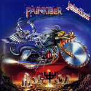</div><div class="album-info"><p class="mb-0"><strong>Year:</strong> 1990<br><strong>Country:</strong> 🇬🇧 United Kingdom<br><strong>Genres:</strong> Speed Metal<br><strong>Favorite Song: <a href="https://www.youtube.com/watch?v=kO_EdmtR5Ck" target="_blank" rel="noopener noreferrer">Painkiller</a></strong></p></div></div><div class="toggle-tags"><div class="d-flex gap-2 mb-2 mt-2"></div></div>
## 45. Kate Bush - Hounds of Love{.album data-country="United Kingdom" data-passion="0" data-dreamy="0" data-dark="0" data-groovy="0" data-angry="0" data-happy="0" data-sad="0" data-rank="45" data-year="1985"}
<div class="album-container"><div class="album-image"></div><div class="album-info"><p class="mb-0"><strong>Year:</strong> 1985<br><strong>Country:</strong> 🇬🇧 United Kingdom<br><strong>Genres:</strong> Art Pop<br><strong>Favorite Song: <a href="https://www.youtube.com/watch?v=wp43OdtAAkM" target="_blank" rel="noopener noreferrer">Running Up That Hill (A Deal With God)</a></strong></p></div></div><div class="toggle-tags"><div class="d-flex gap-2 mb-2 mt-2"></div></div>
## 44. My Chemical Romance - Three Cheers for Sweet Revenge{.album data-country="USA" data-passion="0" data-dreamy="0" data-dark="0" data-groovy="0" data-angry="0" data-happy="0" data-sad="0" data-rank="44" data-year="2004"}
<div class="album-container"><div class="album-image">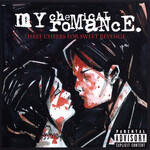</div><div class="album-info"><p class="mb-0"><strong>Year:</strong> 2004<br><strong>Country:</strong> 🇺🇸 USA<br><strong>Genres:</strong> Emo-Pop<br><strong>Favorite Song: <a href="https://www.youtube.com/watch?v=UCCyoocDxBA" target="_blank" rel="noopener noreferrer">Helena</a></strong></p></div></div><div class="toggle-tags"><div class="d-flex gap-2 mb-2 mt-2"></div></div>
## 43. Marvin Gaye - What's Going On{.album data-country="USA" data-passion="0" data-dreamy="0" data-dark="0" data-groovy="0" data-angry="0" data-happy="0" data-sad="0" data-rank="43" data-year="1971"}
<div class="album-container"><div class="album-image"></div><div class="album-info"><p class="mb-0"><strong>Year:</strong> 1971<br><strong>Country:</strong> 🇺🇸 USA<br><strong>Genres:</strong> Smooth Soul<br><strong>Favorite Song: <a href="https://www.youtube.com/watch?v=H-kA3UtBj4M" target="_blank" rel="noopener noreferrer">What's Going On </a></strong></p></div></div><div class="toggle-tags"><div class="d-flex gap-2 mb-2 mt-2"></div></div>
## 41. Angelo Badalamenti - Twin Peaks: Fire Walk With Me {.album .tears_please_stop_flowing .gaze_into_the_abyss data-country="USA" data-passion="0" data-dreamy="0" data-dark="0" data-groovy="0" data-angry="0" data-happy="0" data-sad="0" data-rank="41" data-year="1992"}
<div class="album-container"><div class="album-image">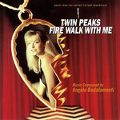</div><div class="album-info"><p class="mb-0"><strong>Year:</strong> 1992<br><strong>Country:</strong> 🇺🇸 USA<br><strong>Genres:</strong> Dark Jazz<br><strong>Favorite Song: <a href="https://www.youtube.com/watch?v=MOSaLtcqob8" target="_blank" rel="noopener noreferrer">Questions in a World of Blue</a></strong></p></div></div><div class="toggle-tags"><div class="d-flex gap-2 mb-2 mt-2"><button id="tears_please_stop_flowing" class="badge bg-primary rounded-pill border-0" onclick="toggleTag(this, 'tears_please_stop_flowing')">Tears Please Stop Flowing</button><button id="gaze_into_the_abyss" class="badge bg-primary rounded-pill border-0" onclick="toggleTag(this, 'gaze_into_the_abyss')"> Gaze Into the Abyss</button></div></div>
## 38. Sun Kil Moon - Ghosts of the Great Highway{.album .sketchy_artist .tears_please_stop_flowing data-country="USA" data-passion="0" data-dreamy="0" data-dark="0" data-groovy="0" data-angry="0" data-happy="0" data-sad="0" data-rank="38" data-year="2003"}
<div class="album-container"><div class="album-image">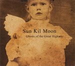</div><div class="album-info"><p class="mb-0"><strong>Year:</strong> 2003<br><strong>Country:</strong> 🇺🇸 USA<br><strong>Genres:</strong> Slowcore<br><strong>Favorite Song: <a href="https://www.youtube.com/watch?v=8-RjqU3T2x4" target="_blank" rel="noopener noreferrer">Duk Koo Kim</a></strong></p></div></div><div class="toggle-tags"><div class="d-flex gap-2 mb-2 mt-2"><button id="sketchy_artist" class="badge bg-primary rounded-pill border-0" onclick="toggleTag(this, 'sketchy_artist')">⚠️ Sketchy Artist</button><button id="tears_please_stop_flowing" class="badge bg-primary rounded-pill border-0" onclick="toggleTag(this, 'tears_please_stop_flowing')"> Tears Please Stop Flowing</button></div></div>
## 37. Lingua Ignota - Caligula{.album .gaze_into_the_abyss data-country="USA" data-passion="0" data-dreamy="0" data-dark="0" data-groovy="0" data-angry="0" data-happy="0" data-sad="0" data-rank="37" data-year="2019"}
<div class="album-container"><div class="album-image"></div><div class="album-info"><p class="mb-0"><strong>Year:</strong> 2019<br><strong>Country:</strong> 🇺🇸 USA<br><strong>Genres:</strong> Neoclassical Darkwave<br><strong>Favorite Song: <a href="https://www.youtube.com/watch?v=8jma4fQfJGI" target="_blank" rel="noopener noreferrer">DO YOU DOUBT ME TRAITOR</a></strong></p></div></div><div class="toggle-tags"><div class="d-flex gap-2 mb-2 mt-2"><button id="gaze_into_the_abyss" class="badge bg-primary rounded-pill border-0" onclick="toggleTag(this, 'gaze_into_the_abyss')">Gaze Into the Abyss</button></div></div>
## 36. Iron Maiden - The Number of the Beast{.album data-country="United Kingdom" data-passion="0" data-dreamy="0" data-dark="0" data-groovy="0" data-angry="0" data-happy="0" data-sad="0" data-rank="36" data-year="1982"}
<div class="album-container"><div class="album-image">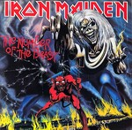</div><div class="album-info"><p class="mb-0"><strong>Year:</strong> 1982<br><strong>Country:</strong> 🇬🇧 United Kingdom<br><strong>Genres:</strong> Heavy Metal<br><strong>Favorite Song: <a href="https://www.youtube.com/watch?v=86URGgqONvA" target="_blank" rel="noopener noreferrer">Run to the Hills</a></strong></p></div></div><div class="toggle-tags"><div class="d-flex gap-2 mb-2 mt-2"></div></div>
## 34. Javiera Mena - Esquemas juveniles{.album data-country="Spain" data-passion="0" data-dreamy="0" data-dark="0" data-groovy="0" data-angry="0" data-happy="0" data-sad="0" data-rank="34" data-year="2005"}
<div class="album-container"><div class="album-image"></div><div class="album-info"><p class="mb-0"><strong>Year:</strong> 2005<br><strong>Country:</strong> 🇪🇸 Spain<br><strong>Genres:</strong> Indie Pop<br><strong>Favorite Song: <a href="https://www.youtube.com/watch?v=vN1AlIBob-o" target="_blank" rel="noopener noreferrer">Cámara lenta</a></strong></p></div></div><div class="toggle-tags"><div class="d-flex gap-2 mb-2 mt-2"></div></div>
## 33. Cameron Winter - Heavy Metal{.album .tears_please_stop_flowing data-country="USA" data-passion="0" data-dreamy="0" data-dark="0" data-groovy="0" data-angry="0" data-happy="0" data-sad="0" data-rank="33" data-year="2024"}
<div class="album-container"><div class="album-image"></div><div class="album-info"><p class="mb-0"><strong>Year:</strong> 2024<br><strong>Country:</strong> 🇺🇸 USA<br><strong>Genres:</strong> Singer-Songwriter<br><strong>Favorite Song: <a href="https://youtu.be/ETZKZzz7MWo?si=-VOGRFzsSmGPMdlH" target="_blank" rel="noopener noreferrer">$0.00</a></strong></p></div></div><div class="toggle-tags"><div class="d-flex gap-2 mb-2 mt-2"><button id="tears_please_stop_flowing" class="badge bg-primary rounded-pill border-0" onclick="toggleTag(this, 'tears_please_stop_flowing')">Tears Please Stop Flowing</button></div></div>
## 32. Portishead - Dummy{.album data-country="United Kingdom" data-passion="0" data-dreamy="0" data-dark="0" data-groovy="0" data-angry="0" data-happy="0" data-sad="0" data-rank="32" data-year="1994"}
<div class="album-container"><div class="album-image">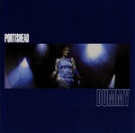</div><div class="album-info"><p class="mb-0"><strong>Year:</strong> 1994<br><strong>Country:</strong> 🇬🇧 United Kingdom<br><strong>Genres:</strong> Trip Hop<br><strong>Favorite Song: <a href="https://www.youtube.com/watch?v=c417rIku6Iw" target="_blank" rel="noopener noreferrer">Glory Box</a></strong></p></div></div><div class="toggle-tags"><div class="d-flex gap-2 mb-2 mt-2"></div></div>
## 31. Electric Light Orchestra - Time{.album .pure_awesome data-country="United Kingdom" data-passion="0" data-dreamy="0" data-dark="0" data-groovy="0" data-angry="0" data-happy="0" data-sad="0" data-rank="31" data-year="1981"}
<div class="album-container"><div class="album-image">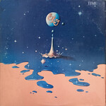</div><div class="album-info"><p class="mb-0"><strong>Year:</strong> 1981<br><strong>Country:</strong> 🇬🇧 United Kingdom<br><strong>Genres:</strong> Pop Rock<br><strong>Favorite Song: <a href="https://www.youtube.com/watch?v=yDN68LxWW-8" target="_blank" rel="noopener noreferrer">Twilight</a></strong></p></div></div><div class="toggle-tags"><div class="d-flex gap-2 mb-2 mt-2"><button id="pure_awesome" class="badge bg-primary rounded-pill border-0" onclick="toggleTag(this, 'pure_awesome')">Pure Awesome</button></div></div>
## 30. Panopticon - ...And Again Into the Light{.album .sound_of_the_revolution data-country="USA" data-passion="0" data-dreamy="0" data-dark="0" data-groovy="0" data-angry="0" data-happy="0" data-sad="0" data-rank="30" data-year="2021"}
<div class="album-container"><div class="album-image">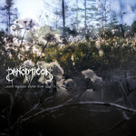</div><div class="album-info"><p class="mb-0"><strong>Year:</strong> 2021<br><strong>Country:</strong> 🇺🇸 USA<br><strong>Genres:</strong> Atmospheric Black Metal<br><strong>Favorite Song: <a href="https://www.youtube.com/watch?v=3SGscxQfmc4" target="_blank" rel="noopener noreferrer">Dead Loons</a></strong></p></div></div><div class="toggle-tags"><div class="d-flex gap-2 mb-2 mt-2"><button id="sound_of_the_revolution" class="badge bg-primary rounded-pill border-0" onclick="toggleTag(this, 'sound_of_the_revolution')">Sound of the Revolution</button></div></div>
## 29. Parannoul - To See the Next Part of the Dream{.album data-country="South Korea" data-passion="0" data-dreamy="0" data-dark="0" data-groovy="0" data-angry="0" data-happy="0" data-sad="0" data-rank="29" data-year="2021"}
<div class="album-container"><div class="album-image"></div><div class="album-info"><p class="mb-0"><strong>Year:</strong> 2021<br><strong>Country:</strong> 🇰🇷 South Korea<br><strong>Genres:</strong> Shoegaze<br><strong>Favorite Song: <a href="https://www.youtube.com/watch?v=g1x1NtWGw5s" target="_blank" rel="noopener noreferrer">White Ceiling</a></strong></p></div></div><div class="toggle-tags"><div class="d-flex gap-2 mb-2 mt-2"></div></div>
## 28. FKA Twigs - Magdalene{.album data-country="United Kingdom" data-passion="0" data-dreamy="0" data-dark="0" data-groovy="0" data-angry="0" data-happy="0" data-sad="0" data-rank="28" data-year="2019"}
<div class="album-container"><div class="album-image"></div><div class="album-info"><p class="mb-0"><strong>Year:</strong> 2019<br><strong>Country:</strong> 🇬🇧 United Kingdom<br><strong>Genres:</strong> Art Pop<br><strong>Favorite Song: <a href="https://www.youtube.com/watch?v=YkLjqFpBh84" target="_blank" rel="noopener noreferrer">Cellophane</a></strong></p></div></div><div class="toggle-tags"><div class="d-flex gap-2 mb-2 mt-2"></div></div>
## 27. Rage Against the Machine - Rage Against the Machine{.album .sound_of_the_revolution data-country="USA" data-passion="0" data-dreamy="0" data-dark="0" data-groovy="0" data-angry="0" data-happy="0" data-sad="0" data-rank="27" data-year="1992"}
<div class="album-container"><div class="album-image"></div><div class="album-info"><p class="mb-0"><strong>Year:</strong> 1992<br><strong>Country:</strong> 🇺🇸 USA<br><strong>Genres:</strong> Alternative Metal<br><strong>Favorite Song: <a href="https://www.youtube.com/watch?v=bWXazVhlyxQ" target="_blank" rel="noopener noreferrer">Killing in the Name</a></strong></p></div></div><div class="toggle-tags"><div class="d-flex gap-2 mb-2 mt-2"><button id="sound_of_the_revolution" class="badge bg-primary rounded-pill border-0" onclick="toggleTag(this, 'sound_of_the_revolution')">Sound of the Revolution</button></div></div>
## 26. David Bowie - Low{.album data-country="United Kingdom" data-passion="0" data-dreamy="0" data-dark="0" data-groovy="0" data-angry="0" data-happy="0" data-sad="0" data-rank="26" data-year="1977"}
<div class="album-container"><div class="album-image">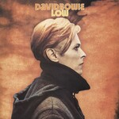</div><div class="album-info"><p class="mb-0"><strong>Year:</strong> 1977<br><strong>Country:</strong> 🇬🇧 United Kingdom<br><strong>Genres:</strong> Art Rock, Ambient<br><strong>Favorite Song: <a href="https://www.youtube.com/watch?v=V_6IhsQEBX0" target="_blank" rel="noopener noreferrer">Warszawa</a></strong></p></div></div><div class="toggle-tags"><div class="d-flex gap-2 mb-2 mt-2"></div></div>
## 25. Perfume - ⊿ (Triangle){.album data-country="Japan" data-passion="0" data-dreamy="0" data-dark="0" data-groovy="0" data-angry="0" data-happy="0" data-sad="0" data-rank="25" data-year="2008"}
<div class="album-container"><div class="album-image">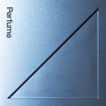</div><div class="album-info"><p class="mb-0"><strong>Year:</strong> 2008<br><strong>Country:</strong> 🇯🇵 Japan<br><strong>Genres:</strong> Electropop<br><strong>Favorite Song: <a href="https://www.youtube.com/watch?v=rBX5YGPNDbs" target="_blank" rel="noopener noreferrer">Dream Fighter</a></strong></p></div></div><div class="toggle-tags"><div class="d-flex gap-2 mb-2 mt-2"></div></div>
## 24. Ocean Machine - Biomech{.album .eclectic_masterpiece data-country="Canada" data-passion="0" data-dreamy="0" data-dark="0" data-groovy="0" data-angry="0" data-happy="0" data-sad="0" data-rank="24" data-year="1997"}
<div class="album-container"><div class="album-image">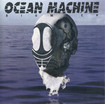</div><div class="album-info"><p class="mb-0"><strong>Year:</strong> 1997<br><strong>Country:</strong> 🇨🇦 Canada<br><strong>Genres:</strong> Progressive Metal<br><strong>Favorite Song: <a href="https://www.youtube.com/watch?v=H6UIm4JAoM8" target="_blank" rel="noopener noreferrer">Bastard</a></strong></p></div></div><div class="toggle-tags"><div class="d-flex gap-2 mb-2 mt-2"><button id="eclectic_masterpiece" class="badge bg-primary rounded-pill border-0" onclick="toggleTag(this, 'eclectic_masterpiece')">Eclectic Masterpiece</button></div></div>
## 23. Charles Mingus - The Black Saint and the Sinner Lady{.album data-country="USA" data-passion="0" data-dreamy="0" data-dark="0" data-groovy="0" data-angry="0" data-happy="0" data-sad="0" data-rank="23" data-year="1963"}
<div class="album-container"><div class="album-image"></div><div class="album-info"><p class="mb-0"><strong>Year:</strong> 1963<br><strong>Country:</strong> 🇺🇸 USA<br><strong>Genres:</strong> Avant-Garde Jazz<br><strong>Favorite Song: <a href="https://www.youtube.com/watch?v=jOaCrz43Sjk" target="_blank" rel="noopener noreferrer">Trio and Group Dancers</a></strong></p></div></div><div class="toggle-tags"><div class="d-flex gap-2 mb-2 mt-2"></div></div>
## 22. Nas - Illmatic{.album data-country="USA" data-passion="0" data-dreamy="0" data-dark="0" data-groovy="0" data-angry="0" data-happy="0" data-sad="0" data-rank="22" data-year="1994"}
<div class="album-container"><div class="album-image"></div><div class="album-info"><p class="mb-0"><strong>Year:</strong> 1994<br><strong>Country:</strong> 🇺🇸 USA<br><strong>Genres:</strong> Boom Bap<br><strong>Favorite Song: <a href="https://www.youtube.com/watch?v=izhKFB0_2w0" target="_blank" rel="noopener noreferrer">N.Y. State of Mind</a></strong></p></div></div><div class="toggle-tags"><div class="d-flex gap-2 mb-2 mt-2"></div></div>
## 21. My Bloody Valentine - Loveless{.album data-country="Ireland" data-passion="0" data-dreamy="0" data-dark="0" data-groovy="0" data-angry="0" data-happy="0" data-sad="0" data-rank="21" data-year="1991"}
<div class="album-container"><div class="album-image">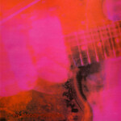</div><div class="album-info"><p class="mb-0"><strong>Year:</strong> 1991<br><strong>Country:</strong> 🇮🇪 Ireland<br><strong>Genres:</strong> Shoegaze<br><strong>Favorite Song: <a href="https://www.youtube.com/watch?v=BJLcbj80Ka8" target="_blank" rel="noopener noreferrer">when you sleep</a></strong></p></div></div><div class="toggle-tags"><div class="d-flex gap-2 mb-2 mt-2"></div></div>
## 20. Kessoku Band - Kessoku Band{.album .soundtrack data-country="Japan" data-passion="0" data-dreamy="0" data-dark="0" data-groovy="0" data-angry="0" data-happy="0" data-sad="0" data-rank="20" data-year="2022"}
<div class="album-container"><div class="album-image"></div><div class="album-info"><p class="mb-0"><strong>Year:</strong> 2022<br><strong>Country:</strong> 🇯🇵 Japan<br><strong>Genres:</strong> Shimokita-kei<br><strong>Favorite Song: <a href="https://www.youtube.com/watch?v=E5O0mCrUdAM" target="_blank" rel="noopener noreferrer">Rockn' Roll, Morning Light Falls on You</a></strong></p></div></div><div class="toggle-tags"><div class="d-flex gap-2 mb-2 mt-2"><button id="soundtrack" class="badge bg-primary rounded-pill border-0" onclick="toggleTag(this, 'soundtrack')">Soundtrack</button></div></div>
## 19. System of a Down - Toxicity{.album .sound_of_the_revolution data-country="USA" data-passion="0" data-dreamy="0" data-dark="0" data-groovy="0" data-angry="0" data-happy="0" data-sad="0" data-rank="19" data-year="2001"}
<div class="album-container"><div class="album-image"></div><div class="album-info"><p class="mb-0"><strong>Year:</strong> 2001<br><strong>Country:</strong> 🇺🇸 USA<br><strong>Genres:</strong> Alternative Metal<br><strong>Favorite Song: <a href="https://www.youtube.com/watch?v=L-iepu3EtyE" target="_blank" rel="noopener noreferrer">Aerials</a></strong></p></div></div><div class="toggle-tags"><div class="d-flex gap-2 mb-2 mt-2"><button id="sound_of_the_revolution" class="badge bg-primary rounded-pill border-0" onclick="toggleTag(this, 'sound_of_the_revolution')">Sound of the Revolution</button></div></div>
## 18. Lana Del Rey - Norman Fucking Rockwell!{.album data-country="USA" data-passion="0" data-dreamy="0" data-dark="0" data-groovy="0" data-angry="0" data-happy="0" data-sad="0" data-rank="18" data-year="2018"}
<div class="album-container"><div class="album-image"></div><div class="album-info"><p class="mb-0"><strong>Year:</strong> 2018<br><strong>Country:</strong> 🇺🇸 USA<br><strong>Genres:</strong> Art Pop<br><strong>Favorite Song: <a href="https://www.youtube.com/watch?v=Qg3DxELVPj4" target="_blank" rel="noopener noreferrer">Venice Bitch</a></strong></p></div></div><div class="toggle-tags"><div class="d-flex gap-2 mb-2 mt-2"></div></div>
## 17. Kendrick Lamar - To Pimp a Butterfly{.album .eclectic_masterpiece data-country="USA" data-passion="0" data-dreamy="0" data-dark="0" data-groovy="0" data-angry="0" data-happy="0" data-sad="0" data-rank="17" data-year="2015"}
<div class="album-container"><div class="album-image">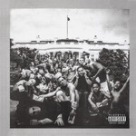</div><div class="album-info"><p class="mb-0"><strong>Year:</strong> 2015<br><strong>Country:</strong> 🇺🇸 USA<br><strong>Genres:</strong> West Coast Hip Hop<br><strong>Favorite Song: <a href="https://www.youtube.com/watch?v=JocAXINz-YE" target="_blank" rel="noopener noreferrer">Alright</a></strong></p></div></div><div class="toggle-tags"><div class="d-flex gap-2 mb-2 mt-2"><button id="eclectic_masterpiece" class="badge bg-primary rounded-pill border-0" onclick="toggleTag(this, 'eclectic_masterpiece')">Eclectic Masterpiece</button></div></div>
## 16. Ichiko Aoba - Windswept Adan{.album .seen_live data-country="Japan" data-passion="0" data-dreamy="0" data-dark="0" data-groovy="0" data-angry="0" data-happy="0" data-sad="0" data-rank="16" data-year="2020"}
<div class="album-container"><div class="album-image">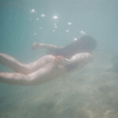</div><div class="album-info"><p class="mb-0"><strong>Year:</strong> 2020<br><strong>Country:</strong> 🇯🇵 Japan<br><strong>Genres:</strong> Chamber Folk<br><strong>Favorite Song: <a href="https://www.youtube.com/watch?v=4JprPTHR808" target="_blank" rel="noopener noreferrer">Porcelain</a></strong></p></div></div><div class="toggle-tags"><div class="d-flex gap-2 mb-2 mt-2"><button id="seen_live" class="badge bg-primary rounded-pill border-0" onclick="toggleTag(this, 'seen_live')">Seen Live</button></div></div>
## 15. Seatbelts - Cowboy Bebop{.album .soundtrack data-country="Japan" data-passion="0" data-dreamy="0" data-dark="0" data-groovy="0" data-angry="0" data-happy="0" data-sad="0" data-rank="15" data-year="1998"}
<div class="album-container"><div class="album-image">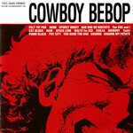</div><div class="album-info"><p class="mb-0"><strong>Year:</strong> 1998<br><strong>Country:</strong> 🇯🇵 Japan<br><strong>Genres:</strong> Jazz<br><strong>Favorite Song: <a href="https://www.youtube.com/watch?v=DybCZvW1mBo" target="_blank" rel="noopener noreferrer">Space Lion</a></strong></p></div></div><div class="toggle-tags"><div class="d-flex gap-2 mb-2 mt-2"><button id="soundtrack" class="badge bg-primary rounded-pill border-0" onclick="toggleTag(this, 'soundtrack')">Soundtrack</button></div></div>
## 14. The Pillows - FLCL Original Soundtrack No. 3{.album data-country="Japan" data-passion="0" data-dreamy="0" data-dark="0" data-groovy="0" data-angry="0" data-happy="0" data-sad="0" data-rank="14" data-year="2005"}
<div class="album-container"><div class="album-image"></div><div class="album-info"><p class="mb-0"><strong>Year:</strong> 2005<br><strong>Country:</strong> 🇯🇵 Japan<br><strong>Genres:</strong> Power Pop<br><strong>Favorite Song: <a href="https://www.youtube.com/watch?v=xB2K-riHfSc" target="_blank" rel="noopener noreferrer">Last Dinosaur</a></strong></p></div></div><div class="toggle-tags"><div class="d-flex gap-2 mb-2 mt-2"></div></div>
## 13. Stevie Wonder - Songs in the Key of Life{.album .pure_awesome data-country="USA" data-passion="0" data-dreamy="0" data-dark="0" data-groovy="0" data-angry="0" data-happy="0" data-sad="0" data-rank="13" data-year="1976"}
<div class="album-container"><div class="album-image">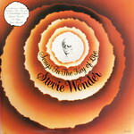</div><div class="album-info"><p class="mb-0"><strong>Year:</strong> 1976<br><strong>Country:</strong> 🇺🇸 USA<br><strong>Genres:</strong> Pop Soul<br><strong>Favorite Song: <a href="https://www.youtube.com/watch?v=EnNgASBdCeo" target="_blank" rel="noopener noreferrer">Sir Duke</a></strong></p></div></div><div class="toggle-tags"><div class="d-flex gap-2 mb-2 mt-2"><button id="pure_awesome" class="badge bg-primary rounded-pill border-0" onclick="toggleTag(this, 'pure_awesome')">Pure Awesome</button></div></div>
## 12. Gorguts - Colored Sands{.album .gaze_into_the_abyss data-country="Canada" data-passion="0" data-dreamy="0" data-dark="0" data-groovy="0" data-angry="0" data-happy="0" data-sad="0" data-rank="12" data-year="2013"}
<div class="album-container"><div class="album-image">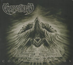</div><div class="album-info"><p class="mb-0"><strong>Year:</strong> 2013<br><strong>Country:</strong> 🇨🇦 Canada<br><strong>Genres:</strong> Dissonant Death Metal<br><strong>Favorite Song: <a href="https://www.youtube.com/watch?v=7LQd0IoJ25M" target="_blank" rel="noopener noreferrer">Le Toit Du Monde</a></strong></p></div></div><div class="toggle-tags"><div class="d-flex gap-2 mb-2 mt-2"><button id="gaze_into_the_abyss" class="badge bg-primary rounded-pill border-0" onclick="toggleTag(this, 'gaze_into_the_abyss')">Gaze Into the Abyss</button></div></div>
## 11. Carly Rae Jepsen - E·MO·TION{.album data-country="Canada" data-passion="0" data-dreamy="0" data-dark="0" data-groovy="0" data-angry="0" data-happy="0" data-sad="0" data-rank="11" data-year="2015"}
<div class="album-container"><div class="album-image">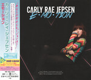</div><div class="album-info"><p class="mb-0"><strong>Year:</strong> 2015<br><strong>Country:</strong> 🇨🇦 Canada<br><strong>Genres:</strong> Synthpop<br><strong>Favorite Song: <a href="https://www.youtube.com/watch?v=TeccAtqd5K8" target="_blank" rel="noopener noreferrer">Run Away With Me</a></strong></p></div></div><div class="toggle-tags"><div class="d-flex gap-2 mb-2 mt-2"></div></div>
## 10. Cocteau Twins - Heaven or Las Vegas {.album data-country="United Kingdom" data-passion="0" data-dreamy="0" data-dark="0" data-groovy="0" data-angry="0" data-happy="0" data-sad="0" data-rank="10" data-year="1990"}
<div class="album-container"><div class="album-image"></div><div class="album-info"><p class="mb-0"><strong>Year:</strong> 1990<br><strong>Country:</strong> 🇬🇧 United Kingdom<br><strong>Genres:</strong> Dream Pop<br><strong>Favorite Song: <a href="https://www.youtube.com/watch?v=JlwcQR5HHck" target="_blank" rel="noopener noreferrer">Heaven or Las Vegas </a></strong></p></div></div><div class="toggle-tags"><div class="d-flex gap-2 mb-2 mt-2"></div></div>
## 9. Radiohead - In Rainbows{.album data-country="United Kingdom" data-passion="0" data-dreamy="0" data-dark="0" data-groovy="0" data-angry="0" data-happy="0" data-sad="0" data-rank="9" data-year="2008"}
<div class="album-container"><div class="album-image">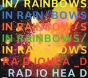</div><div class="album-info"><p class="mb-0"><strong>Year:</strong> 2008<br><strong>Country:</strong> 🇬🇧 United Kingdom<br><strong>Genres:</strong> Art Rock<br><strong>Favorite Song: <a href="https://www.youtube.com/watch?v=OIdrE5igo-k" target="_blank" rel="noopener noreferrer">Weird Fishes/Arpeggi</a></strong></p></div></div><div class="toggle-tags"><div class="d-flex gap-2 mb-2 mt-2"></div></div>
## 8. Pink Floyd - Wish You Were Here{.album data-country="United Kingdom" data-passion="0" data-dreamy="0" data-dark="0" data-groovy="0" data-angry="0" data-happy="0" data-sad="0" data-rank="8" data-year="1975"}
<div class="album-container"><div class="album-image">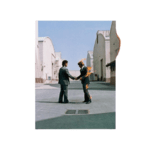</div><div class="album-info"><p class="mb-0"><strong>Year:</strong> 1975<br><strong>Country:</strong> 🇬🇧 United Kingdom<br><strong>Genres:</strong> Art Rock<br><strong>Favorite Song: <a href="https://www.youtube.com/watch?v=K6qj09OHvjw" target="_blank" rel="noopener noreferrer">Wish You Were Here</a></strong></p></div></div><div class="toggle-tags"><div class="d-flex gap-2 mb-2 mt-2"></div></div>
## 7. Mac Miller - Circles{.album .tears_please_stop_flowing data-country="USA" data-passion="0" data-dreamy="0" data-dark="0" data-groovy="0" data-angry="0" data-happy="0" data-sad="0" data-rank="7" data-year="2020"}
<div class="album-container"><div class="album-image"></div><div class="album-info"><p class="mb-0"><strong>Year:</strong> 2020<br><strong>Country:</strong> 🇺🇸 USA<br><strong>Genres:</strong> Neo-Soul<br><strong>Favorite Song: <a href="https://www.youtube.com/watch?v=aIHF7u9Wwiw" target="_blank" rel="noopener noreferrer">Good News</a></strong></p></div></div><div class="toggle-tags"><div class="d-flex gap-2 mb-2 mt-2"><button id="tears_please_stop_flowing" class="badge bg-primary rounded-pill border-0" onclick="toggleTag(this, 'tears_please_stop_flowing')">Tears Please Stop Flowing</button></div></div>
## 6. Keiichi Okabe & Keigo Hoashi - NieR:Automata {.album .soundtrack data-country="Japan" data-passion="0" data-dreamy="0" data-dark="0" data-groovy="0" data-angry="0" data-happy="0" data-sad="0" data-rank="6" data-year="2017"}
<div class="album-container"><div class="album-image"></div><div class="album-info"><p class="mb-0"><strong>Year:</strong> 2017<br><strong>Country:</strong> 🇯🇵 Japan<br><strong>Genres:</strong> Cinematic Classical, Ambient, New Age<br><strong>Favorite Song: <a href="https://www.youtube.com/watch?v=LC5HsZt4oNc" target="_blank" rel="noopener noreferrer">City Ruins (Rays of Light)</a></strong></p></div></div><div class="toggle-tags"><div class="d-flex gap-2 mb-2 mt-2"><button id="soundtrack" class="badge bg-primary rounded-pill border-0" onclick="toggleTag(this, 'soundtrack')">Soundtrack</button></div></div>
## 5. Converge - Jane Doe{.album data-country="USA" data-passion="0" data-dreamy="0" data-dark="0" data-groovy="0" data-angry="0" data-happy="0" data-sad="0" data-rank="5" data-year="2001"}
<div class="album-container"><div class="album-image"></div><div class="album-info"><p class="mb-0"><strong>Year:</strong> 2001<br><strong>Country:</strong> 🇺🇸 USA<br><strong>Genres:</strong> Mathcore<br><strong>Favorite Song: <a href="https://www.youtube.com/watch?v=2WGbgnDQF6A" target="_blank" rel="noopener noreferrer">Jane Doe</a></strong></p></div></div><div class="toggle-tags"><div class="d-flex gap-2 mb-2 mt-2"></div></div>
## 4. Kinoko Teikoku - Eureka{.album .tears_please_stop_flowing data-country="Japan" data-passion="0" data-dreamy="0" data-dark="0" data-groovy="0" data-angry="0" data-happy="0" data-sad="0" data-rank="4" data-year="2013"}
<div class="album-container"><div class="album-image"></div><div class="album-info"><p class="mb-0"><strong>Year:</strong> 2013<br><strong>Country:</strong> 🇯🇵 Japan<br><strong>Genres:</strong> Indie Rock, Shoegaze<br><strong>Favorite Song: <a href="https://www.youtube.com/watch?v=vA1Ph6SpTkI" target="_blank" rel="noopener noreferrer">Musician</a></strong></p></div></div><div class="toggle-tags"><div class="d-flex gap-2 mb-2 mt-2"><button id="tears_please_stop_flowing" class="badge bg-primary rounded-pill border-0" onclick="toggleTag(this, 'tears_please_stop_flowing')">Tears Please Stop Flowing</button></div></div>
## 3. Shiina Ringo - Kalk Samen Kuri no Hana{.album .eclectic_masterpiece data-country="Japan" data-passion="0" data-dreamy="0" data-dark="0" data-groovy="0" data-angry="0" data-happy="0" data-sad="0" data-rank="3" data-year="2003"}
<div class="album-container"><div class="album-image">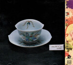</div><div class="album-info"><p class="mb-0"><strong>Year:</strong> 2003<br><strong>Country:</strong> 🇯🇵 Japan<br><strong>Genres:</strong> Art Pop, Art Rock<br><strong>Favorite Song: <a href="https://www.youtube.com/watch?v=pKQqsJGJKfU" target="_blank" rel="noopener noreferrer"> Shuukyou -Religion- </a></strong></p></div></div><div class="toggle-tags"><div class="d-flex gap-2 mb-2 mt-2"><button id="eclectic_masterpiece" class="badge bg-primary rounded-pill border-0" onclick="toggleTag(this, 'eclectic_masterpiece')">Eclectic Masterpiece</button></div></div>
## 2. Carissa's Wierd - Songs About Leaving{.album .tears_please_stop_flowing data-country="USA" data-passion="0" data-dreamy="0" data-dark="0" data-groovy="0" data-angry="0" data-happy="0" data-sad="0" data-rank="2" data-year="2002"}
<div class="album-container"><div class="album-image">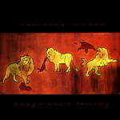</div><div class="album-info"><p class="mb-0"><strong>Year:</strong> 2002<br><strong>Country:</strong> 🇺🇸 USA<br><strong>Genres:</strong> Slowcore<br><strong>Favorite Song: <a href="https://www.youtube.com/watch?v=cYtdQccn54I" target="_blank" rel="noopener noreferrer">September Come Take This Heart Away</a></strong></p></div></div><div class="toggle-tags"><div class="d-flex gap-2 mb-2 mt-2"><button id="tears_please_stop_flowing" class="badge bg-primary rounded-pill border-0" onclick="toggleTag(this, 'tears_please_stop_flowing')">Tears Please Stop Flowing</button></div></div>
## 1. Light Bringer - Scenes of Infinity{.album .pure_awesome data-country="Japan" data-passion="0" data-dreamy="0" data-dark="0" data-groovy="0" data-angry="0" data-happy="0" data-sad="0" data-rank="1" data-year="2013"}
<div class="album-container"><div class="album-image"></div><div class="album-info"><p class="mb-0"><strong>Year:</strong> 2013<br><strong>Country:</strong> 🇯🇵 Japan<br><strong>Genres:</strong> Power Metal, Symphonic Metal<br><strong>Favorite Song: <a href="https://www.youtube.com/watch?v=Qnqud-E4aXM" target="_blank" rel="noopener noreferrer">Hyperion</a></strong></p></div></div><div class="toggle-tags"><div class="d-flex gap-2 mb-2 mt-2"><button id="pure_awesome" class="badge bg-primary rounded-pill border-0" onclick="toggleTag(this, 'pure_awesome')">Pure Awesome</button></div></div>
</div>

<br>

## Stats

{.lightbox}
{.lightbox}

```{python}
# import numpy as np
# import pandas as pd
# import plotly.express as px
# import plotly.io as pio

# pio.templates["my_default"] = pio.templates["simple_white"]
# pio.templates["my_default"].layout.update(
#     font=dict(size=15),
#     xaxis=dict(tickfont=dict(size=16)),
#     yaxis=dict(tickfont=dict(size=16)),
#     margin=dict(l=60, r=30, t=50, b=60),
#     width=None,
#     height=None
# )
# pio.templates["my_default"].layout.colorway = ["#4269D0"]

# INPUT_CSV = "../data/albums.csv"
# df = pd.read_csv(INPUT_CSV)
# df = df.head(100)
# df = df.sort_index(ascending=False)
# df["Decade"] = df["Year"].astype(str).str.slice(0,-3) + ["0"]

# counts = (
#     df.groupby(["Country", "CountryName"])
#       .size()
#       .reset_index(name="count")
# ).sort_values("count", ascending=False).rename(columns={"count": "Count"})

# # Country bars

# fig = px.bar(
#     counts,
#     x="Country",
#     y="Count",
#     hover_data=["CountryName"],
#     text="Count",
#     template="my_default"
# )

# fig.update_traces(textposition="outside")

# fig.update_layout(
#     yaxis_title=None
# )

# fig.update_xaxes(
#     showline=True,
#     linecolor="black",
#     ticks="outside",
#     mirror=False,
#     fixedrange=True
# )

# fig.update_yaxes(
#     showline=True,
#     linecolor="black",
#     ticks="outside",
#     mirror=False,
#     fixedrange=True,
#     title=None
# )
# fig.show(config={"responsive": True})

# # Decade histogram

# dd = df[df["Decade"] != "0"].sort_values(by="Decade")
# dd_counts = dd["Decade"].value_counts().sort_index()

# fig = px.bar(
#     x=dd_counts.index,
#     y=dd_counts.values,
#     template="my_default",
#     text=dd_counts.values
# )

# fig.update_traces(textposition="outside")
# fig.update_layout(
#     yaxis_title=None
# )
# fig.update_xaxes(
#     showline=True,
#     linecolor="black",
#     ticks="outside",
#     mirror=False,
#     fixedrange=True,
#     title="Decade"
# )

# fig.update_yaxes(
#     showline=True,
#     linecolor="black",
#     ticks="outside",
#     mirror=False,
#     fixedrange=True,
#     title=None
# )
# fig.show(config={"responsive": True})
```

<script>

function sortSections(by = "rank", direction = "desc", numeric = true) {
  const container = document.querySelector(".albums");
  const sections = Array.from(container.querySelectorAll("section"));
  sections.sort((a, b) => {
    let aVal = a.dataset[by];
    let bVal = b.dataset[by];

    if (numeric) {
      aVal = Number(aVal);
      bVal = Number(bVal);
      return direction === "desc" ? bVal - aVal : aVal - bVal;
    } else {
      return direction === "desc"
        ? bVal.localeCompare(aVal)
        : aVal.localeCompare(bVal);
    }
  });

  sections.forEach(section => container.appendChild(section));
}

// function filterSections(hasmaxattribute) {
//   document.querySelectorAll(".section").forEach(section => {
//     const h2 = section.querySelector("h2")
//     const match = hasmaxattribute === "all" || 
//                   h2.dataset.hasmaxattribute === hasmaxattribute

//     section.style.display = match ? "" : "none"
//   })
// }

// const switchMaxMood = document.getElementById("toggleMaxMood");
//   switchMaxMood.addEventListener("change", (e) => {
//     if (e.target.checked) {
//       filterSections("True");
//     } else {
//       filterSections("all");
//     }
//   });


//// TAG FILTERS ////

let activeFilters = {};
let tagFilterActive = false;

function toggleTag(button, tagname) {
    //const isActive = button.classList.contains("active-filter");
    tagFilterActive = !tagFilterActive;

    if (!tagFilterActive) {
        // Activate filter
        //button.classList.add("active-filter");
        //button.classList.add("outline-active");
        filterTags(true, tagname);
    } else {
        // Deactivate filter
        //button.classList.remove("active-filter");
        //button.classList.remove("outline-active");
        filterTags(false, tagname);
    }
}

function filterTags(activateFilter, tagname) {
    const container = document.querySelector(".albums");
    const sections = Array.from(container.querySelectorAll("section"));
    console.log(tagFilterActive)
    console.log(activateFilter)
    console.log(tagname)
    sections.forEach(album => {
        console.log(album)
        if (activateFilter) {
            if (!album.classList.contains(tagname)) {
                album.style.display = "none";
            }
        } else {
            album.style.display = "";
        }
    });
}
</script>
