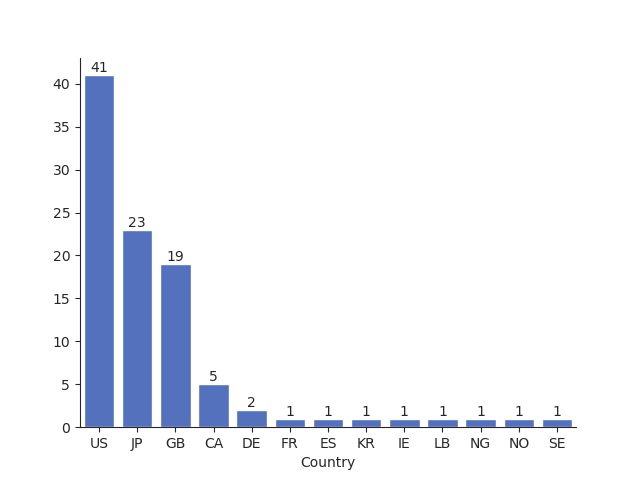
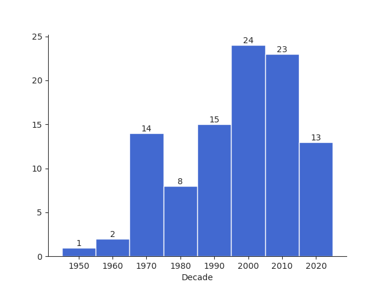

The greatest albums of all time!!! (According to me)\


::: {.callout-note title="Notes"}
- Click on a <span class="badge bg-primary rounded-pill">Tag</span> to filter the list!
- One album per artist.
- Classical releases are not eligible and are covered in a [separate list](classical.qmd).
:::


<div class="dropdown">
  <button class="btn btn-primary dropdown-toggle" type="button"
          data-bs-toggle="dropdown" aria-expanded="false">
    Sort
  </button>
  <ul class="dropdown-menu">
    <li>
      <a class="dropdown-item" href="#"
         onclick="sortSections('rank','desc'); return false;">
        Rank
      </a>
    </li>
    <li>
      <a class="dropdown-item" href="#"
         onclick="sortSections('year','asc'); return false;">
        Year
      </a>
    </li>
    <li>
      <a class="dropdown-item" href="#"
         onclick="sortSections('country','asc',false); return false;">
        Country
      </a>
    </li>
  </ul>
</div>

{{CONTENT}}

<br>

<!---
## Stats

{.lightbox}
{.lightbox}
--->

```{python}
# import numpy as np
# import pandas as pd
# import plotly.express as px
# import plotly.io as pio

# pio.templates["my_default"] = pio.templates["simple_white"]
# pio.templates["my_default"].layout.update(
#     font=dict(size=15),
#     xaxis=dict(tickfont=dict(size=16)),
#     yaxis=dict(tickfont=dict(size=16)),
#     margin=dict(l=60, r=30, t=50, b=60),
#     width=None,
#     height=None
# )
# pio.templates["my_default"].layout.colorway = ["#4269D0"]

# INPUT_CSV = "../data/albums.csv"
# df = pd.read_csv(INPUT_CSV)
# df = df.head(100)
# df = df.sort_index(ascending=False)
# df["Decade"] = df["Year"].astype(str).str.slice(0,-3) + ["0"]

# counts = (
#     df.groupby(["Country", "CountryName"])
#       .size()
#       .reset_index(name="count")
# ).sort_values("count", ascending=False).rename(columns={"count": "Count"})

# # Country bars

# fig = px.bar(
#     counts,
#     x="Country",
#     y="Count",
#     hover_data=["CountryName"],
#     text="Count",
#     template="my_default"
# )

# fig.update_traces(textposition="outside")

# fig.update_layout(
#     yaxis_title=None
# )

# fig.update_xaxes(
#     showline=True,
#     linecolor="black",
#     ticks="outside",
#     mirror=False,
#     fixedrange=True
# )

# fig.update_yaxes(
#     showline=True,
#     linecolor="black",
#     ticks="outside",
#     mirror=False,
#     fixedrange=True,
#     title=None
# )
# fig.show(config={"responsive": True})

# # Decade histogram

# dd = df[df["Decade"] != "0"].sort_values(by="Decade")
# dd_counts = dd["Decade"].value_counts().sort_index()

# fig = px.bar(
#     x=dd_counts.index,
#     y=dd_counts.values,
#     template="my_default",
#     text=dd_counts.values
# )

# fig.update_traces(textposition="outside")
# fig.update_layout(
#     yaxis_title=None
# )
# fig.update_xaxes(
#     showline=True,
#     linecolor="black",
#     ticks="outside",
#     mirror=False,
#     fixedrange=True,
#     title="Decade"
# )

# fig.update_yaxes(
#     showline=True,
#     linecolor="black",
#     ticks="outside",
#     mirror=False,
#     fixedrange=True,
#     title=None
# )
# fig.show(config={"responsive": True})
```

<script>

function sortSections(by = "rank", direction = "desc", numeric = true) {
  const container = document.querySelector(".albums");
  const sections = Array.from(container.querySelectorAll("section"));
  sections.sort((a, b) => {
    let aVal = a.dataset[by];
    let bVal = b.dataset[by];

    if (numeric) {
      aVal = Number(aVal);
      bVal = Number(bVal);
      return direction === "desc" ? bVal - aVal : aVal - bVal;
    } else {
      return direction === "desc"
        ? bVal.localeCompare(aVal)
        : aVal.localeCompare(bVal);
    }
  });

  sections.forEach(section => container.appendChild(section));
}

// function filterSections(hasmaxattribute) {
//   document.querySelectorAll(".section").forEach(section => {
//     const h2 = section.querySelector("h2")
//     const match = hasmaxattribute === "all" || 
//                   h2.dataset.hasmaxattribute === hasmaxattribute

//     section.style.display = match ? "" : "none"
//   })
// }

// const switchMaxMood = document.getElementById("toggleMaxMood");
//   switchMaxMood.addEventListener("change", (e) => {
//     if (e.target.checked) {
//       filterSections("True");
//     } else {
//       filterSections("all");
//     }
//   });


//// TAG FILTERS ////

let tagFilterActive = false;
let activeTagName = "";

function toggleTag(button, tagname) {
    activateFilter = activeTagName != tagname;

    if (activateFilter) {
        // Activate filter
        //filterTags(false, tagname); // reset
        filterTags(true, tagname);
        activeTagName = tagname;
    } else {
        // Deactivate filter
        filterTags(false, tagname);
        activeTagName = "";
    }
}

function filterTags(activateFilter, tagname) {
    const container = document.querySelector(".albums");
    const sections = Array.from(container.querySelectorAll("section"));
    const buttons = Array.from(container.querySelectorAll("button"));

    sections.forEach(album => {
        if (activateFilter) {
            if (!album.classList.contains(tagname)) {
                album.style.display = "none";
            } else{
                album.style.display = "";
            }
        } else {
            album.style.display = "";
        }
    });

    buttons.forEach(button => {
      if (activateFilter) {
          if (button.id !== tagname) {
              button.classList.remove("bg-success");
              button.classList.add("bg-warning");
          } else {
              button.classList.remove("bg-warning");
              button.classList.add("bg-success");
          }
      } else {
          button.classList.remove("bg-warning");
          button.classList.remove("bg-success");
          button.classList.add("bg-primary");
      }
    });
}
</script>
